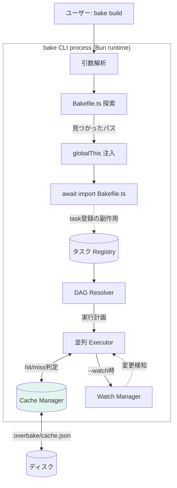
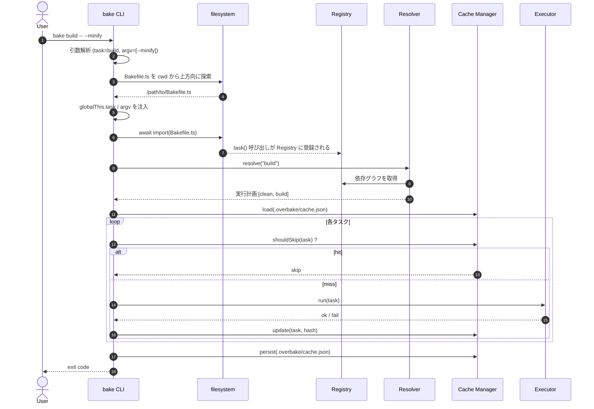
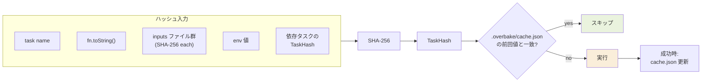
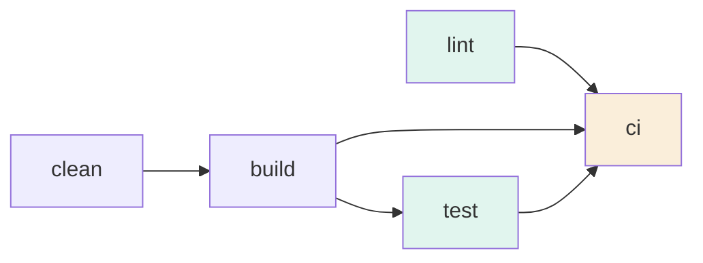
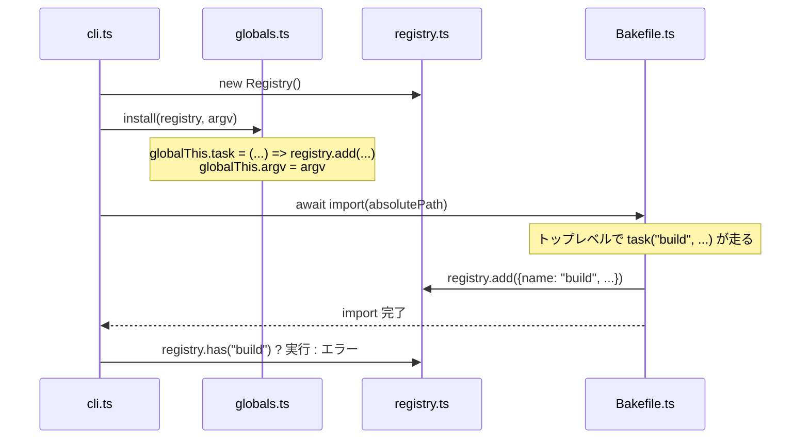
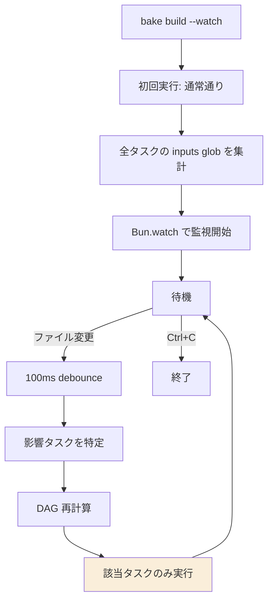

# Overbake — 設計書

> Bun 製のグローバルインストール可能な TypeScript タスクランナー。
> Make の精神を継承しつつ、コンテンツハッシュベースのインクリメンタルビルドと DAG 並列実行を備える。

- **対象読者**: 実装担当のシニアエンジニア
- **ステータス**: 設計レビュー済 / 実装計画改訂済
- **バージョン**: v0.1 (MVP)

---

## 1. 概要

Overbake は `bun add -g overbake` でグローバルインストールするタスクランナー。プロジェクトルートに置かれた `Bakefile.ts` を自動検出し、`bake <task>` で実行する。

### 1.1 設計の核心

**「ユーザーは何も import しない。`tsconfig` も触らない。それでも型補完が効く」** を成立させること。これを実現する仕組みは 3 つの組み合わせで成り立つ:

1. `bake` CLI 自身が Bun プロセスである(サブプロセスを spawn せず、同プロセス内で `await import()` する)
2. CLI が `Bakefile.ts` を import する直前に `globalThis.task` 等を注入する
3. `bake init` が生成する `Bakefile.d.ts` がエディタの型補完を担う(実行時には不要)

### 1.2 既存ツールとの位置づけ

| ツール | 特徴 | Overbake との違い |
|---|---|---|
| Make | mtime ベース、シェルスクリプト中心 | TS で書ける、コンテンツハッシュ、git checkout で壊れない |
| npm scripts | 依存なし、インクリメンタル無し | DAG・キャッシュ・watch を内蔵 |
| just | TS 非対応、キャッシュ無し | TS ネイティブ、インクリメンタル |
| Turborepo | モノレポ前提、JSON 設定 | 単一リポジトリ、TS 設定、軽量 |
| go-task | YAML 設定 | TS で関数として書ける |

Overbake のスイートスポット: **Bun を採用している中小規模プロジェクトの「現代的な Make」**。

---

## 2. ゴールと非ゴール

### 2.1 ゴール (MVP)

- [x] 依存ライブラリゼロ
- [x] `Bakefile.ts` を TS で記述、import 不要、`tsconfig` 不要で型補完が効く
- [ ] cwd から上方向に `Bakefile.ts` を自動探索
- [ ] `deps` による DAG 解決と並列実行
- [ ] コンテンツハッシュベースのインクリメンタルビルド (`inputs` / `outputs`)
- [x] `--watch` モードで該当タスクのみ再実行
- [x] `bake init` で初期化、`Bakefile.d.ts` を生成
- [x] `--dry-run` / `--explain` でデバッグ可能

### 2.2 非ゴール (MVP では扱わない)

- リモートキャッシュ (S3/R2 共有)
- モノレポ・ワークスペース機能
- プラグインシステム
- TUI / リッチプログレス表示
- 多言語ランタイム (Bun 専用)

---

## 3. アーキテクチャ全体図



CLI は単一の Bun プロセスとして起動し、`Bakefile.ts` を import することでタスクを Registry に登録する。Registry の中身を Resolver が DAG に組み立て、Executor が Cache Manager と連携しながら並列実行する。

---

## 4. ファイル構成

```
overbake/
├── package.json                    # "bin": { "bake": "dist/cli.js" }
├── src/
│   ├── cli/
│   │   ├── main.ts                 # bin エントリポイント。例外を終了コードへ変換する最外層
│   │   ├── args.ts                 # 引数解析。CLI 文字列から Command 型へ変換
│   │   ├── commands.ts             # init/list/run/clean-cache の振り分け
│   │   └── exit.ts                 # 終了コードとユーザー向けエラー整形
│   ├── bakefile/
│   │   ├── discover.ts             # Bakefile.ts の上方向探索と -f 指定の正規化
│   │   ├── globals.ts              # globalThis への task/argv 注入と後始末
│   │   ├── loader.ts               # Bakefile.ts import と Registry 生成の orchestration
│   │   └── registry.ts             # task() 登録、重複検出、一覧取得
│   ├── graph/
│   │   ├── resolver.ts             # 到達可能タスク収集、未定義 deps 検出
│   │   ├── cycle.ts                # 循環検出と循環パス生成
│   │   └── plan.ts                 # 実行対象 DAG から ExecutionPlan を生成
│   ├── runtime/
│   │   ├── executor.ts             # 依存充足ベースの並列実行
│   │   ├── scheduler.ts            # jobs/keep-going/fail-fast の状態遷移
│   │   └── hooks.ts                # before/after フック実行と duration 計測
│   ├── cache/
│   │   ├── store.ts                # .overbake/cache.json の read/write
│   │   ├── hash.ts                 # TaskHash とファイルハッシュ計算
│   │   ├── glob.ts                 # inputs/outputs glob 展開
│   │   └── explain.ts              # cache miss 理由の差分生成
│   ├── watch/
│   │   ├── watcher.ts              # Bun.watch のライフサイクル管理
│   │   ├── debounce.ts             # 変更イベント集約
│   │   └── impact.ts               # 変更ファイルから再実行タスクを特定
│   ├── init/
│   │   ├── init.ts                 # bake init コマンド本体
│   │   ├── gitignore.ts            # .gitignore 追記ロジック
│   │   └── templates.ts            # 生成テンプレートの読み込み
│   ├── ui/
│   │   ├── logger.ts               # quiet/verbose/explain 出力
│   │   ├── format.ts               # 色、prefix、表形式出力
│   │   └── help.ts                 # グローバル/タスク別 help の生成
│   ├── shared/
│   │   ├── errors.ts               # ConfigError/TaskFailure 等の共通エラー
│   │   ├── fs.ts                   # Bun.file まわりの薄い I/O ヘルパー
│   │   └── path.ts                 # パス正規化。cwd と bakefile root の扱いを集約
│   └── types.ts                    # 公開 API と内部境界で共有する型
├── templates/
│   ├── Bakefile.ts                 # init で生成するサンプル
│   └── Bakefile.d.ts               # init で生成する型宣言
└── test/
    ├── unit/
    │   ├── bakefile/
    │   ├── graph/
    │   ├── cache/
    │   └── watch/
    ├── integration/
    │   └── cli/
    └── fixtures/
```

`dist/cli.js` は `bun build src/cli/main.ts --target=bun --outfile dist/cli.js` で生成する単一ファイル。

### 4.1 関心の分離ルール

実装の依存方向は **CLI → アプリケーション境界 → ドメイン → I/O** の一方向に固定する。循環 import を避けるため、各ディレクトリの責務を以下に限定する。

| ディレクトリ | 責務 | import してよい主な層 | import してはいけない層 |
|---|---|---|---|
| `cli/` | ユーザー入力、終了コード、コマンド分岐 | 全層 | なし |
| `bakefile/` | Bakefile の発見、global 注入、Registry 構築 | `shared/`, `types.ts` | `runtime/`, `cache/`, `watch/`, `ui/` |
| `graph/` | タスク定義から実行計画を作る純粋ロジック | `types.ts` | `cli/`, `runtime/`, `cache/`, `watch/`, `ui/` |
| `runtime/` | 実行計画を副作用として実行する | `graph/`, `cache/`, `ui/`, `shared/` | `cli/`, `bakefile/` |
| `cache/` | ハッシュ計算と cache.json 永続化 | `shared/`, `types.ts` | `cli/`, `runtime/`, `watch/` |
| `watch/` | ファイル変更監視と影響範囲計算 | `graph/`, `cache/`, `shared/` | `cli/`, `bakefile/` |
| `init/` | 初期化ファイル生成 | `shared/`, `ui/` | `graph/`, `runtime/`, `cache/`, `watch/` |
| `ui/` | 表示整形だけ | `types.ts` | ドメイン状態の変更 |
| `shared/` | 低レベル共通処理 | 標準 API / Bun API | プロダクト固有の上位層 |

### 4.2 設計レビュー結果

現行設計の方向性は妥当。ただし実装前に以下を修正方針として確定する。

1. **`src/index.ts` への集約は禁止**
   CLI エントリポイントは薄く保ち、引数解析・Bakefile import・DAG 解決・実行・キャッシュを別モジュールへ分離する。

2. **`resolver.ts` と `executor.ts` の境界を明確化する**
   Resolver は「何をどの依存関係で実行するか」だけを返す。キャッシュ hit/miss、jobs、keep-going は Executor/Scheduler の責務にする。

3. **Cache は Executor から呼ばれる補助機能に限定する**
   Cache が実行順序を判断しない。Cache は `computeTaskHash`、`shouldSkip`、`writeEntry` を提供し、最終判断は実行オーケストレーション側で行う。

4. **Watch は再実行対象の選定だけを持つ**
   Watcher はファイルイベントを受け取り、影響タスク集合を返す。実行そのものは通常の `runtime/` を再利用する。

5. **UI はドメイン判定を持たない**
   `--explain` の文言生成は `ui/` でよいが、差分計算は `cache/explain.ts` に置く。

6. **テストは境界ごとに置く**
   DAG、cache、discover、impact はユニットテスト。CLI、init、実際の Bakefile import は integration テストで検証する。

---

## 5. コア API 仕様

### 5.1 ユーザーが書く `Bakefile.ts`

```typescript
// Bakefile.ts (型補完は同階層の Bakefile.d.ts が担う)

task("clean", { desc: "ビルド成果物を削除" }, async () => {
  await Bun.$`rm -rf dist`;
});

task("build", {
  desc: "TypeScript をバンドル",
  deps: ["clean"],
  inputs: ["src/**/*.ts", "package.json"],
  outputs: ["dist/**/*.js"],
  env: ["NODE_ENV"],
}, async () => {
  await Bun.$`bun build src/index.ts --outdir dist`;
});

task("test", {
  deps: ["build"],
  inputs: ["src/**/*.ts", "test/**/*.ts"],
  // outputs 省略 → 常にキャッシュ無効、毎回実行
}, async () => {
  await Bun.$`bun test`;
});

// fn 省略 = メタタスク(依存を実行するだけ)
task("ci", { deps: ["build", "test"] });
```

### 5.2 `task()` シグネチャ

```typescript
type TaskFn = () => void | Promise<void>;

interface TaskOptions {
  /** 短い説明。bake -l と bake --help <task> に表示 */
  desc?: string;
  /** 先に実行する他タスク名の配列 */
  deps?: string[];
  /** 入力ファイルの glob 配列。指定するとハッシュ判定の対象になる */
  inputs?: string[];
  /** 出力ファイルの glob 配列。指定するとキャッシュ判定が有効化される */
  outputs?: string[];
  /** ハッシュに含める環境変数名の配列 */
  env?: string[];
  /** 実行前フック */
  before?: (ctx: HookContext) => void | Promise<void>;
  /** 実行後フック(成功・失敗どちらでも呼ばれる) */
  after?: (ctx: HookContext & { ok: boolean; durationMs: number }) => void | Promise<void>;
}

interface HookContext {
  name: string;
}

// 3 つのオーバーロード。戻り値はタスクハンドル (runEach に渡せる)
declare function task(name: string, fn: TaskFn): Task;
declare function task(name: string, opts: TaskOptions, fn: TaskFn): Task;
declare function task(name: string, opts: TaskOptions): Task; // メタタスク

declare const argv: string[]; // `--` 以降の引数
```

### 5.3 `ctx.runEach()` — まとめて実行

`scripts/sanity.sh` 相当の体験を 1 タスクで表現するためのヘルパー。タスクハンドルまたはコマンドタプル
(`[command, args?]`) を混在で受け取り、順に実行する。

```typescript
const typecheck = task("typecheck", { desc: "型チェック" }, async ({ cmd }) => {
  await cmd("bunx", ["tsc", "--noEmit"]);
});
const fmt = task("fmt", { desc: "フォーマットチェック" }, async ({ cmd }) => {
  await cmd("bunx", ["biome", "check", "."]);
});
const test = task("test", { desc: "テストを実行" }, async ({ cmd }) => {
  await cmd("bun", ["test"]);
});

task("sanity", { desc: "まとめて検証" }, async ({ runEach }) => {
  await runEach(
    { done: "✨ All checks passed!" },
    typecheck, fmt, ["bun", ["build"]], test,
  );
});
```

- 各工程の出力 (`cmd` の stdout/stderr, `ctx.log`, `console.log/error`) は抑制してバッファに溜める。
- 工程が失敗したら、その工程のバッファ内容を表示して例外を投げる。既定は **fail-fast**(最初の失敗で残りを実行しない)。
- `{ keepGoing: true }` を先頭に渡すと全件実行し、失敗をまとめて報告する。
- 全件成功時は `{ done }` のメッセージ(未指定なら既定文言)を出力する。
- タスクハンドルは `before`/`after` フックは実行するが、`deps` はここでは展開しない。

### 5.4 注入される global

| 名前 | 型 | 用途 |
|---|---|---|
| `task` | 上記関数 | タスク登録 |
| `argv` | `string[]` | `bake build -- --watch` の `--watch` を受け取る |

`$` は `Bun.$` を直接使う方針(Bun の型定義は `bun-types` でカバーされるため、Overbake 側で再実装しない)。

---

## 6. 実行フロー(全体シーケンス)



---

## 7. インクリメンタルビルド設計(詳細)

### 7.1 キャッシュキーの構成

各タスクの「実行が必要か」を判定するハッシュは以下を SHA-256 で連結して計算する:

```
TaskHash = SHA256(
  task.name
  | normalize(fn.toString())
  | sort(inputs).map(f => SHA256(content(f)))
  | sort(env).map(k => `${k}=${process.env[k]}`)
  | sort(deps).map(d => TaskHash(d))     // 依存先のハッシュも巻き込む
)
```

依存先のハッシュを巻き込むことで、「依存タスクが再実行されたら自分も再実行」が自然に成立する。



### 7.2 判定ロジック疑似コード

```typescript
async function shouldSkip(task: Task, cache: Cache): Promise<SkipReason | null> {
  if (!task.outputs || task.outputs.length === 0) {
    return null; // outputs 未宣言は常に実行
  }

  const currentHash = await computeTaskHash(task, cache);
  const entry = cache.entries[task.name];

  if (!entry) return null; // 初回実行
  if (entry.hash !== currentHash) return null; // ハッシュ不一致

  // outputs が物理的に存在するかも確認
  const outputsExist = await checkOutputsExist(task.outputs);
  if (!outputsExist) return null;

  return { reason: "cache-hit", hash: currentHash };
}
```

### 7.3 `.overbake/cache.json` スキーマ

```typescript
interface CacheFile {
  version: 1;
  entries: {
    [taskName: string]: {
      hash: string;              // 上記の TaskHash
      lastRunAt: string;         // ISO8601
      durationMs: number;        // 直近成功時の所要時間
      inputs: Record<string, string>;  // ファイル → SHA-256 (explain 用)
      outputs: Record<string, string>; // ファイル → SHA-256
    };
  };
}
```

`inputs` / `outputs` の個別ハッシュを保持することで、`--explain` 時に「どのファイルが原因で再実行されるか」を表示できる。

### 7.4 `--explain` 出力例

```
$ bake build --explain
[build] cache miss: input changed
  src/index.ts: a3f9..  →  b7c2..
  src/util.ts:   unchanged
  package.json:  unchanged
[build] running...
```

---

## 8. DAG 解決と並列実行

### 8.1 依存解決アルゴリズム

1. 目標タスクから DFS で到達可能なタスクを収集
2. 循環検出(訪問中フラグ法、見つかれば即エラー)
3. トポロジカルソートで実行順序を決定
4. 同じ深さのタスクは並列候補としてまとめる

### 8.2 並列実行モデル



上記グラフで `bake ci` を実行した場合:

- **Wave 1**: `clean`, `lint` (独立)を並列実行
- **Wave 2**: `build` (clean完了後)、`lint` 完了済なら `lint` 完了
- **Wave 3**: `test`
- **Wave 4**: `ci`

実装上は **wave 単位ではなく依存充足ベース**でスケジューリングする(あるタスクの依存が全て完了したら、ワーカー上限の範囲で即座に起動)。これにより wave 内の遅いタスクが後続をブロックしない。

### 8.3 ワーカー上限

- デフォルト: `navigator.hardwareConcurrency`
- `--jobs N` で上書き
- `--jobs 1` で逐次実行(デバッグ用)

### 8.4 エラー時の挙動

- デフォルト(fail-fast): 失敗が出たら新規タスクは起動しない。実行中のタスクは完了を待つ
- `--keep-going`: 全タスクを試行、最後に失敗をまとめて報告
- どちらの場合も exit code は最後の失敗で決まる

---

## 9. Bakefile.ts のディスカバリと注入

### 9.1 探索アルゴリズム

```typescript
async function discover(startDir: string): Promise<string | null> {
  let dir = startDir;
  while (true) {
    const candidate = path.join(dir, "Bakefile.ts");
    if (await Bun.file(candidate).exists()) return candidate;
    const parent = path.dirname(dir);
    if (parent === dir) return null; // ルート到達
    dir = parent;
  }
}
```

`.git` 探索と同じ作法。`-f <path>` フラグで明示指定された場合は探索をスキップ。

### 9.2 グローバル注入の順序



**重要**: `globals.install()` は import より**前**に実行する必要がある。Bakefile.ts のトップレベルで `task()` を呼べるようにするため。

---

## 10. Watch モード設計

### 10.1 動作概要



### 10.2 影響タスク特定ロジック

変更されたファイルパス `f` に対して:

1. `f` を `inputs` のいずれかの glob にマッチさせるタスクを列挙
2. それらのタスクと、それを `deps` に持つ全ての祖先タスクをマーク
3. ターゲットタスク(`bake build` の `build`)の子孫に該当するもののみ再実行

### 10.3 debounce

エディタの保存連打や git checkout の大量変更に備えて 100ms の debounce。変更ファイルは debounce 期間中に集約される。

---

## 11. CLI 仕様

### 11.1 サブコマンド一覧

| コマンド | 機能 |
|---|---|
| `bake <task>` | タスク実行 |
| `bake` | デフォルトタスク or 一覧表示 |
| `bake -l` / `bake list` | タスク一覧(desc 付き) |
| `bake init` | Bakefile.ts と Bakefile.d.ts を生成、.gitignore 追記 |
| `bake --help` | グローバルヘルプ |
| `bake --help <task>` | タスク詳細(deps/inputs/outputs/env を含む) |
| `bake clean-cache` | `.overbake/cache.json` を削除 |

### 11.2 フラグ

| フラグ | 効果 |
|---|---|
| `-f <path>` | Bakefile を明示指定 |
| `--watch` | watch モード |
| `--dry-run` | 実行計画だけ表示、副作用なし |
| `--explain` | キャッシュ判定の理由を表示 |
| `--force` | キャッシュ無視、強制再実行 |
| `--jobs N` | 並列度指定 |
| `--keep-going` | 失敗しても他タスクを継続 |
| `--quiet` | タスク出力を抑制 |
| `--verbose` | ハッシュ判定の詳細も出力 |
| `--` | 以降をタスクへの引数として `argv` に渡す |

### 11.3 終了コード

- `0`: 全タスク成功
- `1`: タスク実行失敗
- `2`: 設定エラー(循環依存、未定義タスク参照、Bakefile.ts 不在等)
- `130`: SIGINT (Ctrl+C)

---

## 12. 型補完の仕組み(`Bakefile.d.ts`)

### 12.1 生成される `Bakefile.d.ts`

```typescript
// Bakefile.d.ts — bake init が生成。コミット推奨。
// このファイルは TypeScript の型補完のためだけに存在し、
// 実行時には参照されません(Overbake CLI が globalThis に注入します)。

type TaskFn = () => void | Promise<void>;

interface HookContext {
  name: string;
}

interface TaskOptions {
  desc?: string;
  deps?: string[];
  inputs?: string[];
  outputs?: string[];
  env?: string[];
  before?: (ctx: HookContext) => void | Promise<void>;
  after?: (ctx: HookContext & { ok: boolean; durationMs: number }) => void | Promise<void>;
}

declare function task(name: string, fn: TaskFn): void;
declare function task(name: string, opts: TaskOptions, fn: TaskFn): void;
declare function task(name: string, opts: TaskOptions): void;

declare const argv: readonly string[];
```

### 12.2 なぜこれが動くか

TypeScript の Language Server は **同階層の `.d.ts` を自動で参照する**(`tsconfig.json` の `include` に明示的に書かれていなくても、ファイルが同じディレクトリにあれば拾われる)。`Bakefile.d.ts` を `declare` で書くことで、グローバルスコープに `task` と `argv` が存在するかのように見える。

実行時には CLI が `globalThis` に注入するため、`.d.ts` の宣言と実体が一致する。

### 12.3 コミット推奨の理由

- チームメンバーが clone 直後から補完が効く
- Overbake のグローバルインストール版の差異に依存しない(ローカルで完結)
- ファイルが小さく diff にノイズが出ない

---

## 13. `bake init` の生成物

```
$ bake init
✓ Bakefile.ts を作成しました
✓ Bakefile.d.ts を作成しました
✓ .gitignore に .overbake/ を追記しました

次のステップ:
  bake -l         タスク一覧を表示
  bake build      build タスクを実行
```

`.gitignore` 追記ロジック:

1. `.gitignore` が存在しない → 新規作成、`.overbake/` のみ書き込む
2. 存在し、`.overbake/` が既に書かれている → スキップ
3. 存在し、未記載 → 末尾に追記(改行を補正)

既存の `Bakefile.ts` がある場合は上書き確認 (`--force` でスキップ可)。

---

## 14. データ構造リファレンス

### 14.1 Registry 内部表現

```typescript
interface Task {
  name: string;
  desc?: string;
  deps: string[];          // 正規化済(空配列にする)
  inputs?: string[];
  outputs?: string[];
  env?: string[];
  fn?: TaskFn;             // メタタスクは undefined
  before?: HookFn;
  after?: HookFn;
  sourceLocation: { file: string; line: number }; // エラー報告用
}

class Registry {
  private tasks = new Map<string, Task>();
  add(task: Task): void; // 重複登録はエラー
  get(name: string): Task | undefined;
  all(): Task[];
}
```

### 14.2 実行計画

```typescript
interface ExecutionPlan {
  target: string;
  tasks: Task[];          // トポロジカル順
  cached: Set<string>;    // スキップ予定のタスク名
  reasons: Map<string, ExplainReason>; // --explain 用
}
```

---

## 15. ハッシュキー組成の可視化

<svg viewBox="0 0 680 380" xmlns="http://www.w3.org/2000/svg" role="img" aria-labelledby="hash-title hash-desc">
  <title id="hash-title">TaskHash の組成</title>
  <desc id="hash-desc">5 つの入力(name, fn, inputs, env, deps)を SHA-256 に通して TaskHash を生成する</desc>
  <defs>
    <marker id="arr" viewBox="0 0 10 10" refX="8" refY="5" markerWidth="6" markerHeight="6" orient="auto-start-reverse">
      <path d="M2 1L8 5L2 9" fill="none" stroke="#73726c" stroke-width="1.5" stroke-linecap="round" stroke-linejoin="round"/>
    </marker>
  </defs>

  <!-- 入力ノード5つ -->
  <g>
    <rect x="40" y="40" width="180" height="44" rx="8" fill="#EEEDFE" stroke="#534AB7" stroke-width="0.5"/>
    <text x="130" y="62" text-anchor="middle" dominant-baseline="central" font-family="sans-serif" font-size="14" font-weight="500" fill="#3C3489">task.name</text>
  </g>
  <g>
    <rect x="40" y="100" width="180" height="44" rx="8" fill="#EEEDFE" stroke="#534AB7" stroke-width="0.5"/>
    <text x="130" y="122" text-anchor="middle" dominant-baseline="central" font-family="sans-serif" font-size="14" font-weight="500" fill="#3C3489">fn.toString()</text>
  </g>
  <g>
    <rect x="40" y="160" width="180" height="56" rx="8" fill="#E1F5EE" stroke="#0F6E56" stroke-width="0.5"/>
    <text x="130" y="180" text-anchor="middle" dominant-baseline="central" font-family="sans-serif" font-size="14" font-weight="500" fill="#085041">inputs ファイル</text>
    <text x="130" y="200" text-anchor="middle" dominant-baseline="central" font-family="sans-serif" font-size="12" fill="#0F6E56">SHA-256 を連結</text>
  </g>
  <g>
    <rect x="40" y="232" width="180" height="44" rx="8" fill="#FAEEDA" stroke="#854F0B" stroke-width="0.5"/>
    <text x="130" y="254" text-anchor="middle" dominant-baseline="central" font-family="sans-serif" font-size="14" font-weight="500" fill="#633806">env 値</text>
  </g>
  <g>
    <rect x="40" y="292" width="180" height="56" rx="8" fill="#FAECE7" stroke="#993C1D" stroke-width="0.5"/>
    <text x="130" y="312" text-anchor="middle" dominant-baseline="central" font-family="sans-serif" font-size="14" font-weight="500" fill="#712B13">依存タスクの</text>
    <text x="130" y="332" text-anchor="middle" dominant-baseline="central" font-family="sans-serif" font-size="12" fill="#993C1D">TaskHash(再帰)</text>
  </g>

  <!-- 中央の SHA-256 -->
  <g>
    <rect x="300" y="160" width="140" height="60" rx="8" fill="#F1EFE8" stroke="#5F5E5A" stroke-width="0.5"/>
    <text x="370" y="180" text-anchor="middle" dominant-baseline="central" font-family="sans-serif" font-size="14" font-weight="500" fill="#444441">SHA-256</text>
    <text x="370" y="200" text-anchor="middle" dominant-baseline="central" font-family="sans-serif" font-size="12" fill="#5F5E5A">連結ハッシュ</text>
  </g>

  <!-- 矢印: 入力 → SHA-256 -->
  <line x1="220" y1="62" x2="298" y2="180" stroke="#73726c" stroke-width="0.5" marker-end="url(#arr)"/>
  <line x1="220" y1="122" x2="298" y2="185" stroke="#73726c" stroke-width="0.5" marker-end="url(#arr)"/>
  <line x1="220" y1="188" x2="298" y2="190" stroke="#73726c" stroke-width="0.5" marker-end="url(#arr)"/>
  <line x1="220" y1="254" x2="298" y2="195" stroke="#73726c" stroke-width="0.5" marker-end="url(#arr)"/>
  <line x1="220" y1="320" x2="298" y2="200" stroke="#73726c" stroke-width="0.5" marker-end="url(#arr)"/>

  <!-- 出力 -->
  <g>
    <rect x="520" y="160" width="140" height="60" rx="8" fill="#EAF3DE" stroke="#3B6D11" stroke-width="0.5"/>
    <text x="590" y="180" text-anchor="middle" dominant-baseline="central" font-family="sans-serif" font-size="14" font-weight="500" fill="#27500A">TaskHash</text>
    <text x="590" y="200" text-anchor="middle" dominant-baseline="central" font-family="sans-serif" font-size="12" fill="#3B6D11">32 byte (hex 64文字)</text>
  </g>
  <line x1="440" y1="190" x2="518" y2="190" stroke="#73726c" stroke-width="0.5" marker-end="url(#arr)"/>
</svg>

---

## 16. エッジケースと判断

| ケース | 挙動 | 根拠 |
|---|---|---|
| `Bakefile.ts` が見つからない | exit 2、`bake init` を案内 | 親切なエラー UX |
| 同名タスクの二重登録 | exit 2、両方のソース位置を表示 | サイレント上書きはバグ源 |
| 循環依存 | exit 2、循環パスを表示 | DFS で訪問中フラグ検出 |
| `deps` に存在しないタスク名 | exit 2 | 早期失敗 |
| `outputs` 宣言ありで実体が消えた | キャッシュ無効化、再実行 | `rm -rf dist` 後の挙動として自然 |
| `inputs` の glob が 0 件マッチ | 警告、ハッシュは空文字列扱い | エラーにはしない(ファイル生成前のタスクもある) |
| `fn` 省略 + `outputs` 指定 | 設定エラー | メタタスクは出力を持たない |
| watch モード中の Bakefile.ts 変更 | プロセス再起動を案内 | グラフ再構築は複雑、MVP では対応しない |
| 並列実行中のタスクが同じファイルに書く | 検出しない、ユーザー責任 | 静的解析は重い、ドキュメントで注意喚起 |

---

## 17. ログ仕様

デフォルトの出力フォーマット:

```
[clean]   started
[clean]   ✓ done (12ms)
[build]   started
[build]   src/index.ts:5:1: warning: ...
[build]   ✓ done (340ms)
[test]    cache hit, skipped
```

- 並列実行中は各タスクの出力を `[task-name]` プレフィックス付きで行バッファリング
- `--verbose` 時は `[task] cache miss: fn.toString() changed` のような判定理由も出る
- 色付け: 成功=緑、スキップ=灰、失敗=赤、警告=黄。`NO_COLOR` 環境変数を尊重

---

## 18. 実装ロードマップ

### Phase 0: 土台整備

1. `src/` と `test/` を 4 章の構成へ作り替える
2. `package.json` に `bin`、`scripts`、`engines.bun`、`files` を定義する
3. `scripts/sanity.sh` が新構成を検証できる状態にする

この時点では振る舞いを増やさず、以降の実装差分を追跡しやすくする。

### Phase 1: Bakefile 読み込みの最小ループ

4. `cli/args.ts`: `bake <task>`、`--`、`-f` だけを解析
5. `bakefile/registry.ts`: task 登録、正規化、重複検出
6. `bakefile/discover.ts`: cwd 上方向探索と `-f` 指定
7. `bakefile/globals.ts`: `globalThis.task` / `argv` 注入と後始末
8. `bakefile/loader.ts`: Registry 生成から Bakefile import までを統合

完了条件: `Bakefile.ts` のタスクが Registry に登録され、未定義タスクや重複が設定エラーになる。

### Phase 2: DAG と逐次実行

9. `graph/resolver.ts`: 到達可能タスク収集、未定義 deps 検出
10. `graph/cycle.ts`: 循環依存検出と循環パス生成
11. `graph/plan.ts`: トポロジカル順の `ExecutionPlan` 生成
12. `runtime/executor.ts`: `jobs=1` 相当の逐次実行
13. `runtime/hooks.ts`: before/after と duration 計測

完了条件: 依存ありのタスクが正しい順序で実行できる。

### Phase 3: 並列実行と失敗制御

14. `runtime/scheduler.ts`: 依存充足ベーススケジューラ
15. `--jobs`、`--keep-going`、fail-fast の状態遷移
16. 並列ログの prefix 出力

完了条件: 独立タスクが `--jobs 2` 以上で並列実行され、失敗時の挙動が仕様通りになる。

### Phase 4: インクリメンタルビルド

17. `cache/glob.ts`: inputs/outputs 展開
18. `cache/hash.ts`: TaskHash とファイルハッシュ計算
19. `cache/store.ts`: `.overbake/cache.json` の read/write
20. `cache/explain.ts`: hit/miss 理由の差分生成
21. `--force`、`--dry-run`、`--explain`、`clean-cache`

完了条件: inputs 変更なしの 2 回目実行が cache hit でスキップされ、変更時は再実行される。

### Phase 5: Watch

22. `watch/impact.ts`: 変更ファイルから影響タスクを特定
23. `watch/debounce.ts`: 変更イベント集約
24. `watch/watcher.ts`: Bun.watch と通常実行パイプラインの接続
25. `--watch` フラグ

完了条件: `bake build --watch` が対象 inputs の変更で必要なタスクだけを再実行する。

### Phase 6: 初期化・ヘルプ・配布

26. `init/init.ts`: `Bakefile.ts` / `Bakefile.d.ts` 生成
27. `init/gitignore.ts`: `.overbake/` 追記
28. `ui/help.ts`: `bake -l`、`bake --help`、`bake --help <task>`
29. `ui/logger.ts` / `ui/format.ts`: quiet/verbose/NO_COLOR
30. `bun build` で単一ファイル化、`npm publish` 前の package 内容確認

完了条件: `bun add -g overbake` 相当の導線で任意ディレクトリから `bake init` と `bake <task>` が動く。

### Phase 7: テスト戦略

31. ユニットテスト: `graph/`、`cache/`、`bakefile/discover.ts`、`watch/impact.ts`
32. Integration テスト: 実際の fixture Bakefile を import して CLI 実行
33. エラー系テスト: 循環依存、未定義 deps、同名タスク、outputs 消失
34. `scripts/sanity.sh` を Definition of Done として全フェーズで実行

---

## 19. 既知のリスクと未決事項

### 19.1 リスク

| リスク | 影響 | 対応 |
|---|---|---|
| `fn.toString()` の正規化なしによる偽の cache miss | コメント変更で再実行 | 許容。要望があれば v2 で normalize オプション |
| 巨大 inputs(数万ファイル)でのハッシュ計算遅延 | 起動が遅い | mtime + size での簡易チェックをフォールバックに用意する案あり |
| Bakefile.ts 内で動的に task() を呼ぶケース | DAG が起動ごとに変わる可能性 | サポートはするが、watch モードでは未対応と明記 |
| Bun のバージョン差異 | `Bun.$` の API 変化 | minimum bun version を `package.json` の `engines` に書く |

### 19.2 未決(実装中に判断)

- `before`/`after` フックがスキップ時にも呼ばれるか(現状の暫定: スキップ時は呼ばない)
- `--watch` のデフォルト debounce 値(100ms 暫定)
- cache.json のスキーマバージョン migrate ロジック(MVP では version 1 のみ、不一致は破棄)

---

## 20. 受け入れ基準(MVP 完了の定義)

- [ ] `bake init` で生成した Bakefile.ts が `bake build` で実行できる
- [ ] `inputs` を変更しないと 2 回目以降は cache hit でスキップされる
- [ ] `inputs` を変更すると再実行される
- [ ] `deps` 経由で依存タスクが先に実行される
- [ ] 独立タスクが `--jobs 2` 以上で並列実行される
- [ ] 循環依存が exit 2 で報告される
- [ ] `bake build --watch` で src/ の変更を拾って再実行される
- [ ] `bake build --explain` で再実行の理由が表示される
- [ ] `bun add -g overbake` で実機にインストールでき、任意のディレクトリで動く

---

## 付録 A: サンプル Bakefile.ts(完全版)

```typescript
// Bakefile.ts

task("clean", { desc: "ビルド成果物を削除" }, async () => {
  await Bun.$`rm -rf dist coverage`;
});

task("typecheck", {
  desc: "型チェック",
  inputs: ["src/**/*.ts", "tsconfig.json"],
}, async () => {
  await Bun.$`bunx tsc --noEmit`;
});

task("lint", {
  desc: "Lint",
  inputs: ["src/**/*.ts", ".eslintrc.json"],
}, async () => {
  await Bun.$`bunx eslint src`;
});

task("build", {
  desc: "TypeScript をバンドル",
  deps: ["clean", "typecheck"],
  inputs: ["src/**/*.ts", "package.json"],
  outputs: ["dist/**/*"],
  env: ["NODE_ENV"],
}, async () => {
  await Bun.$`bun build src/index.ts --outdir dist --target=bun`;
});

task("test", {
  desc: "テスト実行",
  deps: ["build"],
  inputs: ["src/**/*.ts", "test/**/*.ts"],
}, async () => {
  await Bun.$`bun test ${argv}`;  // bake test -- --coverage が渡る
});

task("ci", {
  desc: "CI で実行する一連のタスク",
  deps: ["lint", "typecheck", "build", "test"],
});
```

## 付録 B: 用語集

- **TaskHash**: タスクの再実行要否判定に使う SHA-256 ハッシュ
- **メタタスク**: `fn` を持たず `deps` だけで他タスクを束ねるタスク
- **Wave**: DAG の同一深さに位置する並列実行候補のグループ(概念上、実装はイベント駆動)
- **inputs/outputs glob**: bash 風の glob パターン。`**/*.ts` のような再帰マッチも可

---

**設計書はここまで。実装フェーズに移行可。**
