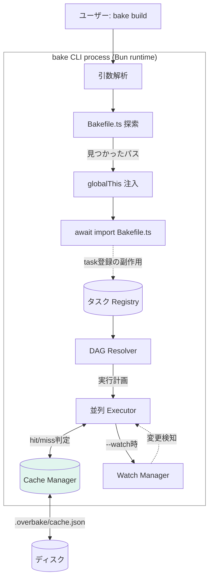
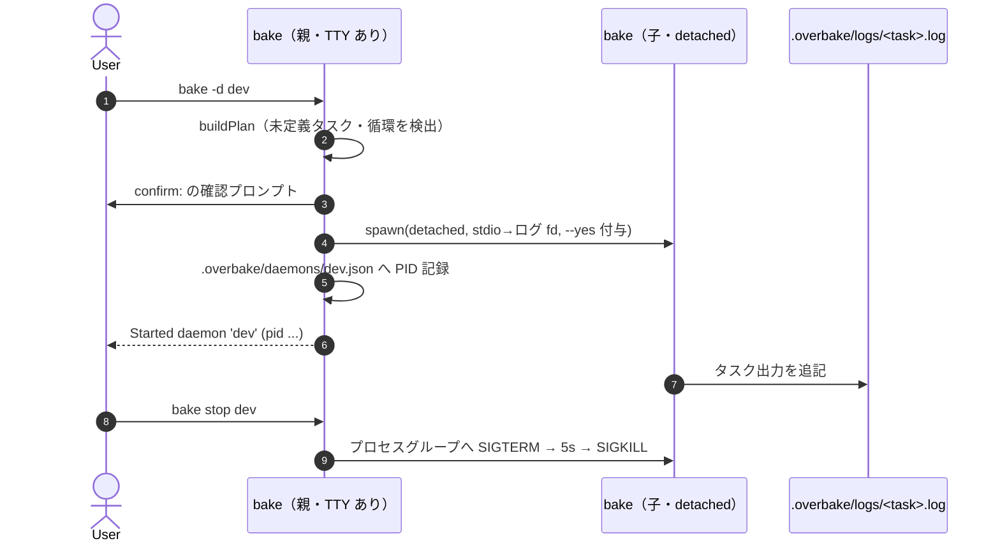
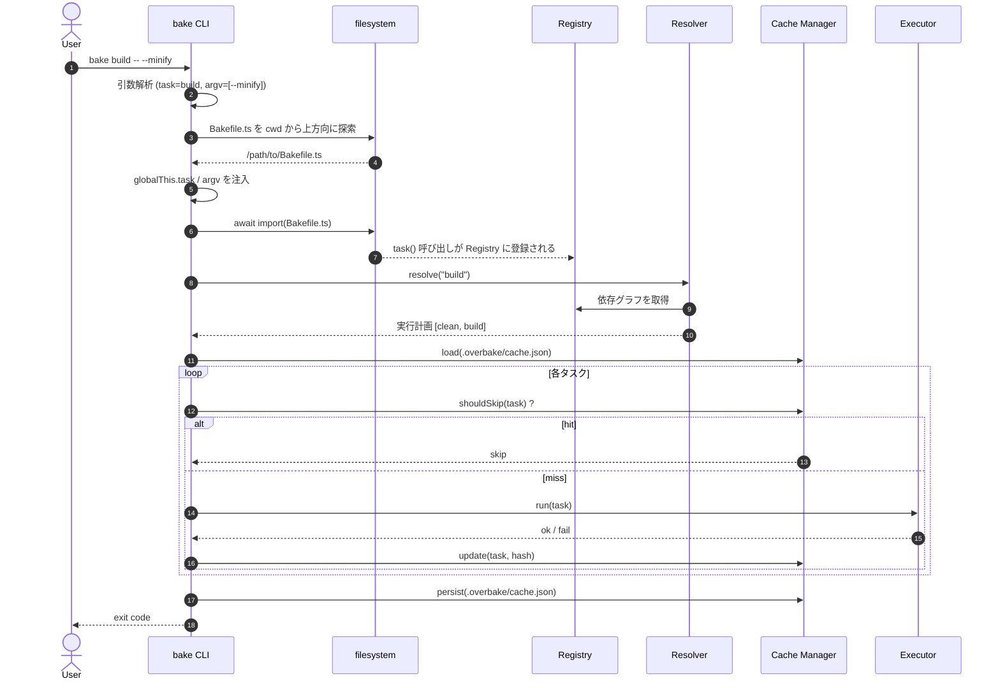
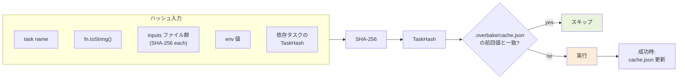
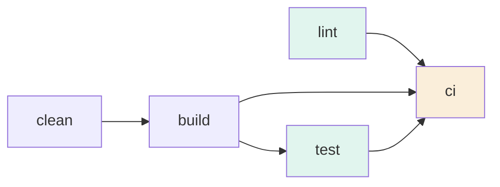
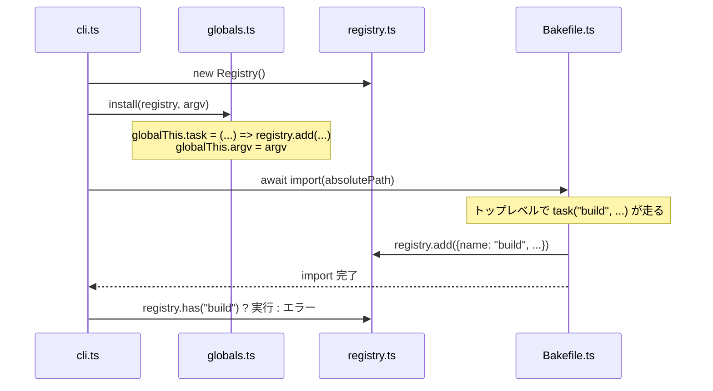
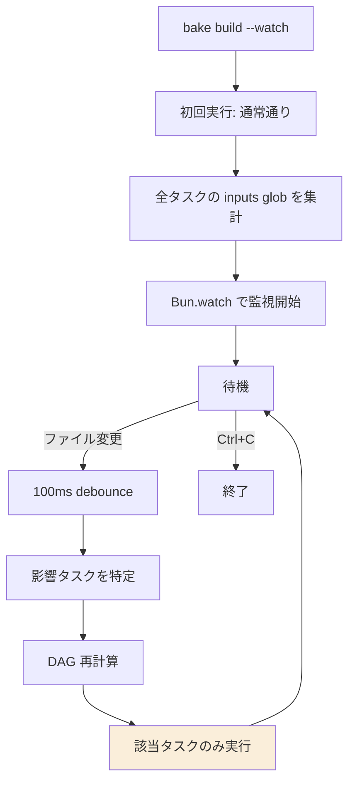

# Overbake — 設計書

> Bun 製のグローバルインストール可能な TypeScript タスクランナー。
> Make の精神を継承しつつ、コンテンツハッシュベースのインクリメンタルビルドと DAG 並列実行を備える。

- **対象読者**: 実装担当のシニアエンジニア
- **ステータス**: 設計レビュー済 / 実装計画改訂済
- **バージョン**: v0.1 (MVP)

---

## 1. 概要

Overbake は `bun add -g overbake` でグローバルインストールするタスクランナー。プロジェクトルートに置かれた `Bakefile.ts` を自動検出し、`bake <task>` で実行する。

### 1.1 設計の核心

**「ユーザーは何も import しない。`tsconfig` も触らない。それでも型補完が効く」** を成立させること。これを実現する仕組みは 3 つの組み合わせで成り立つ:

1. `bake` CLI 自身が Bun プロセスである(サブプロセスを spawn せず、同プロセス内で `await import()` する)
2. CLI が `Bakefile.ts` を import する直前に `globalThis.task` 等を注入する
3. `bake init` が生成する `Bakefile.d.ts` がエディタの型補完を担う(実行時には不要)

### 1.2 既存ツールとの位置づけ

| ツール | 特徴 | Overbake との違い |
|---|---|---|
| Make | mtime ベース、シェルスクリプト中心 | TS で書ける、コンテンツハッシュ、git checkout で壊れない |
| npm scripts | 依存なし、インクリメンタル無し | DAG・キャッシュ・watch を内蔵 |
| just | TS 非対応、キャッシュ無し | TS ネイティブ、インクリメンタル |
| Turborepo | モノレポ前提、JSON 設定 | 単一リポジトリ、TS 設定、軽量 |
| go-task | YAML 設定 | TS で関数として書ける |

Overbake のスイートスポット: **Bun を採用している中小規模プロジェクトの「現代的な Make」**。

---

## 2. ゴールと非ゴール

### 2.1 ゴール (MVP)

- [x] 依存ライブラリゼロ
- [x] `Bakefile.ts` を TS で記述、import 不要、`tsconfig` 不要で型補完が効く
- [ ] cwd から上方向に `Bakefile.ts` を自動探索
- [ ] `deps` による DAG 解決と並列実行
- [ ] コンテンツハッシュベースのインクリメンタルビルド (`inputs` / `outputs`)
- [x] `--watch` モードで該当タスクのみ再実行
- [x] `bake init` で初期化、`Bakefile.d.ts` を生成
- [x] `--dry-run` / `--explain` でデバッグ可能

### 2.2 非ゴール (MVP では扱わない)

- リモートキャッシュ (S3/R2 共有)
- モノレポ・ワークスペース機能
- プラグインシステム
- TUI / リッチプログレス表示
- 多言語ランタイム (Bun 専用)

---

## 3. アーキテクチャ全体図


```mermaid
flowchart TB
    subgraph CLI["bake CLI process (Bun runtime)"]
        Args[引数解析]
        Discover[Bakefile.ts 探索]
        Inject[globalThis 注入]
        Import["await import Bakefile.ts"]
        Registry[(タスク Registry)]
        Resolver[DAG Resolver]
        Cache[(Cache Manager)]
        Executor[並列 Executor]
        Watcher[Watch Manager]
    end

    User[ユーザー: bake build] --> Args
    Args --> Discover
    Discover -->|見つかったパス| Inject
    Inject --> Import
    Import -.->|task登録の副作用| Registry
    Registry --> Resolver
    Resolver -->|実行計画| Executor
    Executor <-->|hit/miss判定| Cache
    Executor -->|--watch時| Watcher
    Watcher -.->|変更検知| Executor

    Cache <-->|.overbake/cache.json| Disk[(ディスク)]

    style CLI fill:none,stroke:#888,stroke-width:1px
    style Registry fill:#EEEDFE
    style Cache fill:#E1F5EE
```

CLI は単一の Bun プロセスとして起動し、`Bakefile.ts` を import することでタスクを Registry に登録する。Registry の中身を Resolver が DAG に組み立て、Executor が Cache Manager と連携しながら並列実行する。

---

## 4. ファイル構成

```
overbake/
├── package.json                    # "bin": { "bake": "dist/cli.js" }
├── src/
│   ├── cli/
│   │   ├── main.ts                 # bin エントリポイント。例外を終了コードへ変換する最外層
│   │   ├── args.ts                 # 引数解析。CLI 文字列から Command 型へ変換
│   │   ├── commands.ts             # init/list/run/clean-cache の振り分け
│   │   └── exit.ts                 # 終了コードとユーザー向けエラー整形
│   ├── bakefile/
│   │   ├── discover.ts             # Bakefile.ts の上方向探索と -f 指定の正規化
│   │   ├── globals.ts              # globalThis への task/argv 注入と後始末
│   │   ├── loader.ts               # Bakefile.ts import と Registry 生成の orchestration
│   │   └── registry.ts             # task() 登録、重複検出、一覧取得
│   ├── graph/
│   │   ├── resolver.ts             # 到達可能タスク収集、未定義 deps 検出
│   │   ├── cycle.ts                # 循環検出と循環パス生成
│   │   └── plan.ts                 # 実行対象 DAG から ExecutionPlan を生成
│   ├── runtime/
│   │   ├── executor.ts             # 依存充足ベースの並列実行
│   │   ├── scheduler.ts            # jobs/keep-going/fail-fast の状態遷移
│   │   └── hooks.ts                # before/after フック実行と duration 計測
│   ├── cache/
│   │   ├── store.ts                # .overbake/cache.json の read/write
│   │   ├── hash.ts                 # TaskHash とファイルハッシュ計算
│   │   ├── glob.ts                 # inputs/outputs glob 展開
│   │   └── explain.ts              # cache miss 理由の差分生成
│   ├── watch/
│   │   ├── watcher.ts              # Bun.watch のライフサイクル管理
│   │   ├── debounce.ts             # 変更イベント集約
│   │   └── impact.ts               # 変更ファイルから再実行タスクを特定
│   ├── init/
│   │   ├── init.ts                 # bake init コマンド本体
│   │   ├── gitignore.ts            # .gitignore 追記ロジック
│   │   └── templates.ts            # 生成テンプレートの読み込み
│   ├── ui/
│   │   ├── logger.ts               # quiet/verbose/explain 出力
│   │   ├── format.ts               # 色、prefix、表形式出力
│   │   └── help.ts                 # グローバル/タスク別 help の生成
│   ├── shared/
│   │   ├── errors.ts               # ConfigError/TaskFailure 等の共通エラー
│   │   ├── fs.ts                   # Bun.file まわりの薄い I/O ヘルパー
│   │   └── path.ts                 # パス正規化。cwd と bakefile root の扱いを集約
│   └── types.ts                    # 公開 API と内部境界で共有する型
├── templates/
│   ├── Bakefile.ts                 # init で生成するサンプル
│   └── Bakefile.d.ts               # init で生成する型宣言
└── test/
    ├── unit/
    │   ├── bakefile/
    │   ├── graph/
    │   ├── cache/
    │   └── watch/
    ├── integration/
    │   └── cli/
    └── fixtures/
```

`dist/cli.js` は `bun build src/cli/main.ts --target=bun --outfile dist/cli.js` で生成する単一ファイル。

### 4.1 関心の分離ルール

実装の依存方向は **CLI → アプリケーション境界 → ドメイン → I/O** の一方向に固定する。循環 import を避けるため、各ディレクトリの責務を以下に限定する。

| ディレクトリ | 責務 | import してよい主な層 | import してはいけない層 |
|---|---|---|---|
| `cli/` | ユーザー入力、終了コード、コマンド分岐 | 全層 | なし |
| `bakefile/` | Bakefile の発見、global 注入、Registry 構築 | `shared/`, `types.ts` | `runtime/`, `cache/`, `watch/`, `ui/` |
| `graph/` | タスク定義から実行計画を作る純粋ロジック | `types.ts` | `cli/`, `runtime/`, `cache/`, `watch/`, `ui/` |
| `runtime/` | 実行計画を副作用として実行する | `graph/`, `cache/`, `ui/`, `shared/` | `cli/`, `bakefile/` |
| `cache/` | ハッシュ計算と cache.json 永続化 | `shared/`, `types.ts` | `cli/`, `runtime/`, `watch/` |
| `watch/` | ファイル変更監視と影響範囲計算 | `graph/`, `cache/`, `shared/` | `cli/`, `bakefile/` |
| `init/` | 初期化ファイル生成 | `shared/`, `ui/` | `graph/`, `runtime/`, `cache/`, `watch/` |
| `ui/` | 表示整形だけ | `types.ts` | ドメイン状態の変更 |
| `shared/` | 低レベル共通処理 | 標準 API / Bun API | プロダクト固有の上位層 |

### 4.2 設計レビュー結果

現行設計の方向性は妥当。ただし実装前に以下を修正方針として確定する。

1. **`src/index.ts` への集約は禁止**
   CLI エントリポイントは薄く保ち、引数解析・Bakefile import・DAG 解決・実行・キャッシュを別モジュールへ分離する。

2. **`resolver.ts` と `executor.ts` の境界を明確化する**
   Resolver は「何をどの依存関係で実行するか」だけを返す。キャッシュ hit/miss、jobs、keep-going は Executor/Scheduler の責務にする。

3. **Cache は Executor から呼ばれる補助機能に限定する**
   Cache が実行順序を判断しない。Cache は `computeTaskHash`、`shouldSkip`、`writeEntry` を提供し、最終判断は実行オーケストレーション側で行う。

4. **Watch は再実行対象の選定だけを持つ**
   Watcher はファイルイベントを受け取り、影響タスク集合を返す。実行そのものは通常の `runtime/` を再利用する。

5. **UI はドメイン判定を持たない**
   `--explain` の文言生成は `ui/` でよいが、差分計算は `cache/explain.ts` に置く。

6. **テストは境界ごとに置く**
   DAG、cache、discover、impact はユニットテスト。CLI、init、実際の Bakefile import は integration テストで検証する。

---

## 5. コア API 仕様

### 5.1 ユーザーが書く `Bakefile.ts`

```typescript
// Bakefile.ts (型補完は同階層の Bakefile.d.ts が担う)

task("clean", { desc: "ビルド成果物を削除" }, async () => {
  await Bun.$`rm -rf dist`;
});

task("build", {
  desc: "TypeScript をバンドル",
  deps: ["clean"],
  inputs: ["src/**/*.ts", "package.json"],
  outputs: ["dist/**/*.js"],
  env: ["NODE_ENV"],
}, async () => {
  await Bun.$`bun build src/index.ts --outdir dist`;
});

task("test", {
  deps: ["build"],
  inputs: ["src/**/*.ts", "test/**/*.ts"],
  // outputs 省略 → 常にキャッシュ無効、毎回実行
}, async () => {
  await Bun.$`bun test`;
});

// fn 省略 = メタタスク(依存を実行するだけ)
task("ci", { deps: ["build", "test"] });
```

### 5.2 `task()` シグネチャ

```typescript
type TaskFn = () => void | Promise<void>;

interface TaskOptions {
  /** 短い説明。bake -l と bake --help <task> に表示 */
  desc?: string;
  /** 先に実行する他タスク名の配列 */
  deps?: string[];
  /** 入力ファイルの glob 配列。指定するとハッシュ判定の対象になる */
  inputs?: string[];
  /** 出力ファイルの glob 配列。指定するとキャッシュ判定が有効化される */
  outputs?: string[];
  /** ハッシュに含める環境変数名の配列 */
  env?: string[];
  /** 実行前フック */
  before?: (ctx: HookContext) => void | Promise<void>;
  /** 実行後フック(成功・失敗どちらでも呼ばれる) */
  after?: (ctx: HookContext & { ok: boolean; durationMs: number }) => void | Promise<void>;
}

interface HookContext {
  name: string;
}

// 3 つのオーバーロード。戻り値はタスクハンドル (runEach に渡せる)
declare function task(name: string, fn: TaskFn): Task;
declare function task(name: string, opts: TaskOptions, fn: TaskFn): Task;
declare function task(name: string, opts: TaskOptions): Task; // メタタスク

declare namespace task {
  export function each(name: string, ...items: (TaskEachOptions | RunEachItem)[]): Task; // 後述 5.3

  // "default" は予約語なので function default(...) とは書けない。defaultTask を default として re-export する
  function defaultTask(task: Task): void; // 既定タスク指定
  export { defaultTask as default };
}

declare const argv: string[]; // `--` 以降の引数
```

### 5.3 `ctx.runEach()` — まとめて実行

`scripts/sanity.sh` 相当の体験を 1 タスクで表現するためのヘルパー。タスクハンドルまたはコマンドタプル
(`[command, args?]`) を混在で受け取り、順に実行する。

```typescript
const typecheck = task("typecheck", { desc: "型チェック" }, async ({ cmd }) => {
  await cmd("bunx", ["tsc", "--noEmit"]);
});
const fmt = task("fmt", { desc: "フォーマットチェック" }, async ({ cmd }) => {
  await cmd("bunx", ["biome", "check", "."]);
});
const test = task("test", { desc: "テストを実行" }, async ({ cmd }) => {
  await cmd("bun", ["test"]);
});

task("sanity", { desc: "まとめて検証" }, async ({ runEach }) => {
  await runEach(
    { done: "✨ All checks passed!" },
    typecheck, fmt, ["bun", ["build"]], test,
  );
});
```

- 各工程の出力 (`cmd` の stdout/stderr, `ctx.log`, `console.log/error`) は抑制してバッファに溜める。
- 工程が失敗したら、その工程のバッファ内容を表示して例外を投げる。既定は **fail-fast**(最初の失敗で残りを実行しない)。
- `{ keepGoing: true }` を先頭に渡すと全件実行し、失敗をまとめて報告する。
- 全件成功時は `{ done }` のメッセージ(未指定なら既定文言)を出力する。
- タスクハンドルは `before`/`after` フックは実行するが、`deps` はここでは展開しない。

#### `task.each()` — 宣言的な runEach タスク

`ctx.runEach` を本体で呼ぶ代わりに `task.each("sanity", { desc, done }, typecheck, fmt, build, test)` と書くと、
工程列が `TaskOptions.each`(`RunEachStep[]` の静的記述)としてタスク定義に保存され、生成された `fn` が
`ctx.runEach(...)` を実行する。実行時挙動は `ctx.runEach` と同じだが、**工程が `bake <task> --graph` の
出力にも `工程 --> タスク` の辺として現れる**(コマンドタプルはコマンド文字列ラベルのノードになる)。本体で
`ctx.runEach` を呼ぶ形は工程が実行時情報のためグラフには出ない。`deps` は `runEach` と同様ここでは展開せず、
グラフ上の辺は表示用であって実行順を変えない(`resolveTasks` は `deps` のみを辿る)。

### 5.4 `task.service()` — 長時間サービス

DB・dev サーバ・worker のような **長時間サービス** を宣言する API。`run` にはタスク関数 /
コマンドタプル / タスクハンドルのいずれも渡せ、`normalizeServiceRun`（`src/bakefile/registry.ts`）が
`TaskFunction` + `ServiceSource`（静的記述。graph / help でどこから来た run かを表示するために使う）
へ正規化する。

```typescript
const db = task.service("db", { ready: { port: 5432, timeoutMs: 120_000 } }, [
  "docker",
  ["compose", "up", "postgres"],
]);
const api = task.service(
  "api",
  { ready: { log: /listening on/ }, failOn: "EADDRINUSE", retry: { attempts: 5 } },
  async ({ cmd }) => cmd("bun", ["run", "--hot", "src/index.ts"], { cwd: "apps/api" }),
);
```

`Service` は `Task` を継承したブランド付き型（`Bakefile.d.ts` 上の `unique symbol`。実行時には存在
しない）で、`task.compose` に渡せるのは `Service` だけという制約を型で表現する。`bake db` のように
単体でも起動でき、生成された `fn` は `ctx.runCompose([[自分自身]])` を呼ぶ——つまり単体実行も
compose の「1 ステージ 1 サービス」と全く同じ経路（監督ループ・停止・ready 判定）を通る。挙動を
2 系統に分けない、という判断。

監督ループ（`src/runtime/service.ts` の `superviseService`）の要点:

- `ready` は `log` / `port` / `check` のいずれか 1 つ。`log` は行バッファ側で判定、`port` / `check` は
  `intervalMs` ごとにポーリングする。`ready` 未指定なら `run` 呼び出し直後に ready。
- 失敗 = ready 前の終了 / ready タイムアウト / ready 後の終了（**`exit 0` も含む**。長時間サービスに
  とって正常終了は想定外）/ `failOn` に一致する出力行（同じ行が `ready.log` にも一致する場合は
  `failOn` を優先）。
- 失敗すると `retry.attempts` 回まで指数バックオフで再起動する:
  `待機(n) = min(delayMs × factor^(n-1), maxDelayMs)`。**`attempts` はサービスの生存期間全体で数え、
  ready になってもリセットしない。** 「起動から通算で何回まで再起動を許すか」という制約であり、
  「安定稼働した実績」を評価してカウンタをリセットする仕組みは意図的に持たない（実装が単純になり、
  無限リトライで気づかず張り付き続ける事故も防げる）。
- 再起動を使い切ると `ServiceFailedError`（`service` / `reason` / `retries` を保持）で `done` を
  reject する。
- 設定値（`ready` / `failOn` / `retry`）は **登録時には検証しない**。`resolveServiceConfig`
  （`src/service/config.ts`）が実行時（監督ループ起動前）と `bake doctor` の両方から呼ばれる唯一の
  検証点で、`task.cron` の `parseSchedule` と同じ「検証ロジックを二重化しない」方針に従う。

`ctx.cmd` は `abortSignal`（compose / service 側が渡す `AbortController`）の abort で `SIGTERM` を送り、
`killGraceMs`（既定 `KILL_GRACE_MS = 5000`）経過しても終了していなければ `SIGKILL` する。この
エスカレーションを `ctx.cmd` 側に持たせたことで、`run` がタスク関数・コマンドタプル・タスクハンドルの
どれであっても停止経路が 1 つに揃う（コマンドタプル・タスクハンドルは内部で `ctx.cmd` を呼ぶだけの
薄いラップなので、自動的に同じ経路に乗る）。プロセス内でサーバを起動するタスク関数（`Bun.serve` 等）
だけは `ctx.cmd` を経由しないため、`TaskContext.signal` を公開し、その abort を待ってから `return`
することを利用者に委ねる。

### 5.5 `task.compose()` — 起動順付きでサービスを束ねる

複数の `task.service` を **起動順（ステージ）** と **同時起動（グループ）** で束ねる宣言型 API。

```typescript
const worker = task.service("worker", ["bun", ["run", "worker.ts"]]);
const web = task.service("web", { ready: { check: async () => (await fetch("http://localhost:5173")).ok } }, [
  "bun",
  ["run", "dev"],
]);

// 起動順: db → (api と worker を同時) → web
task.compose("dev", { desc: "開発環境" }, db, [api, worker], web);
```

- **引数の並び = 起動順**: `task.compose(name, opts?, ...items)` の各 `items` はサービス（1 要素の
  ステージ）または配列（同時起動グループ）で、渡した順にステージとして起動する。素朴な「全部並列」で
  はなく起動順を持たせたのは、DB → API → Web のような依存が現実のワークロードでは大半を占め、
  順序を表現できないと利用者が `ready` を自前でポーリングする羽目になるため。配列で「同時に起動して
  よい集合」を明示できるようにし、無用な直列化（起動時間の悪化）を避ける。
- **前のステージの全サービスが ready になってから次のステージを起動する**。ステージ内は並列に起動し、
  出力は **`[name]` prefix 付きでストリーミング**（`NO_COLOR` / 非 TTY 以外では固定色、ラベルは
  全ステージ横断の最大幅にパディング）。
- **fail-fast**: いずれかのサービスが再起動を使い切って失敗すると、起動済みの全サービスへ `SIGTERM` →
  `graceMs`（既定 `KILL_GRACE_MS`）後 `SIGKILL` の順で停止し、`compose failed: <ServiceFailedError.message>`
  で失敗する。まだ起動していない後続ステージは起動しない。
- **SIGINT / SIGTERM を受け取ったら同じ手順で全サービスを停止するが、こちらは正常終了**（例外を投げ
  ない）。ハンドラは `runCompose` 関数内で install / uninstall するため、compose タスクを抜けたら
  元に戻る。停止直後に子プロセスの終了が「失敗」として先に届いてしまう競合と、その猶予については
  次項参照。
- **検証（`resolveComposeStages`）は登録時ではなく実行時と `bake doctor`**: 空のステージ・サービス
  でない要素・同じサービスの重複指定を検出し、不正なら `compose '<taskName>': <詳細>` で throw する
  （シグナルハンドラ登録より前なので、何も起動しない）。`task.service` と同じ「登録時に検証しない」
  方針に揃えている。
- **graph 描画**: `compose` 列は `TaskOptions.compose: string[][]`（ステージごとのサービス名）として
  焼かれ、`bake <task> --graph` の出力にも `サービス --> タスク` の辺として現れる。`service.source` が
  `task` / `command` の場合は、その由来からサービス自身への辺も追加される（`fn` の場合は辺なし）。
  `deps` は通常 DAG の解決対象だが、`compose` 列は表示用で実行順を変えない。
- **`ctx.compose` は提供しない**(公開 API は宣言形 `task.compose` のみ、API 表面を最小化する方針)。
  内部実装としては `TaskContext.runCompose(stages)` が存在するが、`Bakefile.d.ts` には載せず、ユーザーは
  `task.compose` / `task.service` 経由でのみ使用する。
- **ネストした compose にも停止が伝播する**: `task.service` の `run` が自身の中で `ctx.runCompose(...)`
  を呼ぶ場合（`task.service` で包んだ compose を、さらに外側の compose や `bake stop` から止める構成）、
  外側からの停止要求は `runCompose` に渡した `abortSignal` の abort を通じて内側の compose にも伝わり、
  `SIGINT` / `SIGTERM` と同じ「正常停止」として扱われる（開始時点で既に abort 済みならステージを 1 つも
  起動しない）。以前はこの `abortSignal` が内側の `runCompose` まで配線されておらず、ネストした compose
  が外側の停止要求を無視して起動し続ける不具合があった。

#### 停止の競合と猶予（`FAILURE_SETTLE_MS`）

Ctrl+C や `bake stop` は（§5.7 の通り）プロセスグループ全体へ `SIGINT` / `SIGTERM` を送る。この単一の
シグナルは bake 自身と、`ctx.cmd` が起動したサービスの子プロセスの両方に同時に届きうるため、子プロセス
が bake 自身の `runCompose` のシグナルハンドラ（`onSignal` → 各 `handle.stop()`）より先に、あるいはそれ
と競合するタイミングで終了することがある。監督ループ（`superviseService`）がこの終了を素朴に検知すると
「失敗」と判定してしまい、実際にはユーザーが望んだ停止なのに `compose failed`（exit 1）になってしまう。

これを避けるため、`superviseService` は attempt が失敗で settle してから確定（`failed:` 出力・
retry/`ServiceFailedError`）するまでに `FAILURE_SETTLE_MS`（既定 `100`ms、`src/runtime/service.ts` で
定義）の猶予を置く。猶予の間に停止要求（`handle.stop()`）が届けば、その失敗は確定させず正常終了として
扱う（`failed:` 行も出さない）。副作用として、この競合とは無関係な通常の失敗確定も最短で
`FAILURE_SETTLE_MS` 分だけ遅れる。

検討した代替案とその却下理由:

- **サービスの子プロセスを別プロセスグループで起動する**: 起動時に `detached: true` でグループを分ければ、
  ターミナルの Ctrl+C（プロセスグループへの `SIGINT`）が子プロセスへ直接は届かなくなり、レース自体が
  起きなくなる。しかし却下した。理由は 2 つ: (1) `bake stop` はデーモンのプロセスグループへ `SIGKILL`
  を送って強制停止する経路を持つ（§5.7）。子が別グループにいると、この `SIGKILL` が届かず取り残されて
  しまう。(2) Windows にはプロセスグループへのシグナルが無いため、`detached: true` は新しいコンソール
  （ウィンドウ）を開く扱いになり、サービスの出力が bake 自身のターミナルから切り離されてしまう。
- **シグナルによる終了だけを「正常停止」とみなす（exit code は見ない）**: 子プロセスが `SIGTERM` /
  `SIGKILL` で終了した場合だけ停止として扱い、`exit 0` は常に失敗と判定すれば猶予は要らなくなる。しかし
  却下した。`SIGINT` を自前でハンドルして後片付けしてから `exit 0` で終わる dev サーバ（多くの Node/Bun
  製サーバがこの作法）は、正常な停止であっても「シグナルによる終了」ではなく `exit 0` として観測される
  ため、この判定では吸収できない。

`FAILURE_SETTLE_MS` はこの 2 案の欠点を避けつつ、シグナルの到達順序という非決定的な競合を短い時間窓で
吸収する妥協点として選んだ。

#### `task.each` との使い分け

| 観点 | `task.each` (runEach) | `task.compose` |
|---|---|---|
| プロセス | 短命(完了を待つ) | 長時間(明示的に停止するまで動く) |
| 実行 | 逐次 | ステージは順に、ステージ内は並列 |
| 出力 | 工程ごとに buffer、失敗時のみ表示 | prefix 付きストリーミング |
| 既定の失敗扱い | fail-fast(最初の失敗で残りを止める) | fail-fast(retry を使い切ったサービスが出たら全停止) |
| 正常 exit の扱い | 成功として次へ | **失敗扱い**(長時間サービスでは想定外) |
| SIGINT/SIGTERM 伝播 | (短命のため不要) | 全サービスへ SIGTERM、grace 後 SIGKILL |
| 用途 | typecheck / lint / build / test の連鎖 | DB・dev サーバ・worker など長時間サービスの起動順付き compose |

### 5.6 `task.cron()` — 定期実行ジョブ

スケジュールに従って工程列を繰り返し実行する宣言型 API。工程の書き方は `task.each` と同じで、
実行モデルだけが違う（1 回きりの逐次実行 → スケジュールに従った繰り返し）。

```typescript
const backup = task("backup", async ({ cmd }) => {
  await cmd("bun", ["scripts/backup.ts"]);
});

task.cron("nightly", { schedule: "0 3 * * *", desc: "毎晩バックアップ" }, backup);
```

スケジュール書式:

| 書式 | 例 | 意味 |
|---|---|---|
| 5 フィールド cron | `*/15 9-17 * * 1-5` | 分 時 日 月 曜日（`*` / `*/n` / `a-b` / `a-b/n` / カンマ区切り） |
| エイリアス | `@hourly` `@daily` `@midnight` `@weekly` `@monthly` `@yearly` `@annually` | 定番スケジュール |
| 固定間隔 | `@every 30s` `@every 5m` | 直前の実行完了からの経過時間で発火（最小 1s） |

実行モデル:

- **1 回の発火は `runEach` と同じ**（逐次実行、成功工程の出力は抑制、失敗工程だけ表示）。
- **工程が失敗してもスケジューラは停止しない**（cron の慣習）。失敗を報告して次の発火を待つ。
- **次回時刻は実行完了後に計算する**。実行が長引いて次の発火時刻を過ぎた回は自然にスキップされ、
  多重起動しない。
- **ローカル時刻**で判定する。タイムゾーン指定は MVP では持たない（DST の境界は Date の挙動に従う）。
- `abortSignal` が abort されるとループを抜ける。`task.cron` が返すハンドルは `Task` であって
  `Service` ではないため `task.compose` へ直接は渡せないが、`task.service("別名", cronTask)` で
  包めば、この abort 伝播により Ctrl+C や fail-fast で正しく停止する。
- 出力は `ctx` 経由（`write`）に流すため、`task.service` で包んで compose 配下に入れた場合は
  包んだ側の名前（別名）で `[name]` prefix が付く。
- **検証は `parseSchedule` に一本化**する。登録時には検証せず、実行時と `bake doctor` の
  両方が同じ関数を呼ぶ（検証ロジックの二重化を避ける）。
- **graph 描画**: 工程列は `TaskOptions.cron.steps` として焼かれ、`--graph` に `工程 --> タスク` の
  辺として現れる（`task.each` / `task.compose` と同じ扱い）。

### 5.7 デーモンモード（`-d`）

`bake -d <task>` でタスクをバックグラウンドプロセスとして起動する。長時間サービス
（`task.compose`）や定期ジョブ（`task.cron`）を端末から切り離して常駐させるための仕組み。


```mermaid
sequenceDiagram
    autonumber
    actor U as User
    participant P as bake（親・TTY あり）
    participant C as bake（子・detached）
    participant L as .overbake/logs/<task>.log

    U->>P: bake -d dev
    P->>P: buildPlan（未定義タスク・循環を検出）
    P->>U: confirm: の確認プロンプト
    P->>C: spawn(detached, stdio→ログ fd, --yes 付与)
    P->>P: .overbake/daemons/dev.json へ PID 記録
    P-->>U: Started daemon 'dev' (pid ...)
    C->>L: タスク出力を追記
    U->>P: bake stop dev
    P->>C: プロセスグループへ SIGTERM → 5s → SIGKILL
```

設計上の判断:

- **検証と確認は detach 前の親で行う**。設定エラーを前景の exit 2 として返し、`confirm:` は
  TTY のある側で応答させるため。子には `--yes` を付けて渡し、ログの向こうでプロンプト待ちにしない。
- **停止はプロセスグループ単位**。`detached: true` で子をプロセスグループのリーダーにし、
  `kill(-pid)` で `ctx.cmd` の孫プロセスや compose のサービスまで確実に停止させる
  （PID 単体への kill では孫が残る）。Windows にはプロセスグループシグナルが無いため PID を直接指定する。
- **再実行コマンドの組み立て**。`bun build --compile` 製バイナリでは `process.argv[1]` が
  `/$bunfs/root/...` という仮想パスになり再実行できないため、この場合は `execPath` だけで起動する。
  開発時（`bun src/cli/main.ts`）はスクリプトパスを引き継ぐ。
- **ログは追記**。起動ごとに `=== <task> started at <ISO8601> ===` の区切りを入れる。
  子の stdout はファイルなので `isTTY` が false になり、色付けは自動的に無効化される。
- **1 タスクのみ**。複数常駐は `task.compose` で束ねる（compose 全体が 1 デーモンになる）。
- **`--dry-run` / `--explain` は `-d` より優先**（副作用が無く、前景で結果を見たいコマンドのため）。

ファイル配置:

```
.overbake/
├── logs/<task>.log       # stdout / stderr の追記先
└── daemons/<task>.json   # name / pid / startedAt / logFile / command / cwd
```

ログのローテーション:

長期常駐でログが無限に増えないよう、**デーモンの子プロセス自身**が自分のログサイズを定期確認し
（既定 5 秒間隔）、しきい値を超えたら世代退避する。既定は 1MB × 3 世代。

```
dev.log → dev.log.1 → dev.log.2 → dev.log.3 →（削除）
```

**なぜ rename ではなく copytruncate なのか**: デーモンの子プロセスと、そこから `ctx.cmd` や
`Bun.$` で起動される孫プロセスは、ログファイルの **fd を継承したまま** 書き続ける。ファイルを
rename して新規作成すると、書き手は rename 後の inode に書き続けるため新しいログが空のままになる。
Node/Bun には `dup2` 相当が無く、起動後に子の fd を差し替えることもできない。そこで
「内容を `<log>.1` へコピー → live なファイルを `truncate(0)`」という copytruncate 方式を採る。
fd は `O_APPEND` で開いているため切り詰め後の書き込みは先頭から続き、スパースホールも生じない。
コピーと切り詰めの間の書き込みが失われうる点は logrotate の `copytruncate` と同じ既知の妥協。

**なぜ子プロセス側で行うのか**: `-d` を実行した親プロセスは spawn 後すぐ終了するため、常駐中の
サイズを見張れるのは fd を握っている子プロセス自身しかいない。親は `OVERBAKE_DAEMON_LOG` で
ログのパスを子へ渡し、子が起動時にサイズ監視タイマーを張る（タイマーは `unref` するので
プロセスの寿命には影響しない）。前回までのログの超過分は、書き手が居ない `-d` 起動時に親が退避する。

| 環境変数 | 既定 | 意味 |
|---|---|---|
| `OVERBAKE_LOG_MAX_BYTES` | `1048576`(1MB) | しきい値。`0` で無効 |
| `OVERBAKE_LOG_KEEP` | `3` | 保持世代数。`0` は退避せず切り詰めのみ |
| `OVERBAKE_LOG_CHECK_MS` | `5000` | サイズ確認間隔 |

既知の制限（MVP では扱わない）:

| 制限 | 影響 | 判断 |
|---|---|---|
| `bake logs` は全体を読んでから末尾を切り出す | 巨大ログでメモリを使う | 実装の単純さを優先 |
| 状態ファイルは PID ベース | PID 再利用で別プロセスを生存と誤認しうる | 起動時刻の照合まではせず、単純さを優先 |

### 5.8 注入される global

| 名前 | 型 | 用途 |
|---|---|---|
| `task` | 上記関数 | タスク登録 |
| `argv` | `string[]` | `bake build -- --watch` の `--watch` を受け取る |

`$` は `Bun.$` を直接使う方針(Bun の型定義は `bun-types` でカバーされるため、Overbake 側で再実装しない)。

---

## 6. 実行フロー(全体シーケンス)


```mermaid
sequenceDiagram
    autonumber
    actor U as User
    participant CLI as bake CLI
    participant FS as filesystem
    participant Reg as Registry
    participant Res as Resolver
    participant Cache as Cache Manager
    participant Exec as Executor

    U->>CLI: bake build -- --minify
    CLI->>CLI: 引数解析 (task=build, argv=[--minify])
    CLI->>FS: Bakefile.ts を cwd から上方向に探索
    FS-->>CLI: /path/to/Bakefile.ts
    CLI->>CLI: globalThis.task / argv を注入
    CLI->>FS: await import(Bakefile.ts)
    FS-->>Reg: task() 呼び出しが Registry に登録される
    CLI->>Res: resolve("build")
    Res->>Reg: 依存グラフを取得
    Res-->>CLI: 実行計画 [clean, build]
    CLI->>Cache: load(.overbake/cache.json)
    loop 各タスク
        CLI->>Cache: shouldSkip(task) ?
        alt hit
            Cache-->>CLI: skip
        else miss
            CLI->>Exec: run(task)
            Exec-->>CLI: ok / fail
            CLI->>Cache: update(task, hash)
        end
    end
    CLI->>Cache: persist(.overbake/cache.json)
    CLI-->>U: exit code
```

---

## 7. インクリメンタルビルド設計(詳細)

### 7.1 キャッシュキーの構成

各タスクの「実行が必要か」を判定するハッシュは以下を SHA-256 で連結して計算する:

```
TaskHash = SHA256(
  task.name
  | normalize(fn.toString())
  | sort(inputs).map(f => SHA256(content(f)))
  | sort(env).map(k => `${k}=${process.env[k]}`)
  | sort(deps).map(d => TaskHash(d))     // 依存先のハッシュも巻き込む
)
```

依存先のハッシュを巻き込むことで、「依存タスクが再実行されたら自分も再実行」が自然に成立する。


```mermaid
flowchart LR
    subgraph Inputs["ハッシュ入力"]
        N[task name]
        F["fn.toString()"]
        I["inputs ファイル群<br/>(SHA-256 each)"]
        E["env 値"]
        D["依存タスクの<br/>TaskHash"]
    end

    Inputs --> H[SHA-256]
    H --> TH[TaskHash]
    TH --> J{".overbake/cache.json<br/>の前回値と一致?"}
    J -->|yes| S[スキップ]
    J -->|no| R[実行]
    R --> U["成功時:<br/>cache.json 更新"]

    style S fill:#EAF3DE
    style R fill:#FAEEDA
```

### 7.2 判定ロジック疑似コード

```typescript
async function shouldSkip(task: Task, cache: Cache): Promise<SkipReason | null> {
  if (!task.outputs || task.outputs.length === 0) {
    return null; // outputs 未宣言は常に実行
  }

  const currentHash = await computeTaskHash(task, cache);
  const entry = cache.entries[task.name];

  if (!entry) return null; // 初回実行
  if (entry.hash !== currentHash) return null; // ハッシュ不一致

  // outputs が物理的に存在するかも確認
  const outputsExist = await checkOutputsExist(task.outputs);
  if (!outputsExist) return null;

  return { reason: "cache-hit", hash: currentHash };
}
```

### 7.3 `.overbake/cache.json` スキーマ

```typescript
interface CacheFile {
  version: 1;
  entries: {
    [taskName: string]: {
      hash: string;              // 上記の TaskHash
      lastRunAt: string;         // ISO8601
      durationMs: number;        // 直近成功時の所要時間
      inputs: Record<string, string>;  // ファイル → SHA-256 (explain 用)
      outputs: Record<string, string>; // ファイル → SHA-256
    };
  };
}
```

`inputs` / `outputs` の個別ハッシュを保持することで、`--explain` 時に「どのファイルが原因で再実行されるか」を表示できる。

### 7.4 `--explain` 出力例

```
$ bake build --explain
[build] cache miss: input changed
  src/index.ts: a3f9..  →  b7c2..
  src/util.ts:   unchanged
  package.json:  unchanged
[build] running...
```

---

## 8. DAG 解決と並列実行

### 8.1 依存解決アルゴリズム

1. 目標タスクから DFS で到達可能なタスクを収集
2. 循環検出(訪問中フラグ法、見つかれば即エラー)
3. トポロジカルソートで実行順序を決定
4. 同じ深さのタスクは並列候補としてまとめる

### 8.2 並列実行モデル


```mermaid
flowchart LR
    clean[clean]
    build[build]
    lint[lint]
    test[test]
    ci[ci]

    clean --> build
    build --> test
    lint --> ci
    build --> ci
    test --> ci

    style clean fill:#EEEDFE
    style build fill:#EEEDFE
    style lint fill:#E1F5EE
    style test fill:#E1F5EE
    style ci fill:#FAEEDA
```

上記グラフで `bake ci` を実行した場合:

- **Wave 1**: `clean`, `lint` (独立)を並列実行
- **Wave 2**: `build` (clean完了後)、`lint` 完了済なら `lint` 完了
- **Wave 3**: `test`
- **Wave 4**: `ci`

実装上は **wave 単位ではなく依存充足ベース**でスケジューリングする(あるタスクの依存が全て完了したら、ワーカー上限の範囲で即座に起動)。これにより wave 内の遅いタスクが後続をブロックしない。

### 8.3 ワーカー上限

- デフォルト: `navigator.hardwareConcurrency`
- `--jobs N` で上書き
- `--jobs 1` で逐次実行(デバッグ用)

### 8.4 エラー時の挙動

- デフォルト(fail-fast): 失敗が出たら新規タスクは起動しない。実行中のタスクは完了を待つ
- `--keep-going`: 全タスクを試行、最後に失敗をまとめて報告
- どちらの場合も exit code は最後の失敗で決まる

---

## 9. Bakefile.ts のディスカバリと注入

### 9.1 探索アルゴリズム

```typescript
async function discover(startDir: string): Promise<string | null> {
  let dir = startDir;
  while (true) {
    const candidate = path.join(dir, "Bakefile.ts");
    if (await Bun.file(candidate).exists()) return candidate;
    const parent = path.dirname(dir);
    if (parent === dir) return null; // ルート到達
    dir = parent;
  }
}
```

`.git` 探索と同じ作法。`-f <path>` フラグで明示指定された場合は探索をスキップ。

### 9.2 グローバル注入の順序


```mermaid
sequenceDiagram
    participant CLI as cli.ts
    participant G as globals.ts
    participant Reg as registry.ts
    participant BF as Bakefile.ts

    CLI->>Reg: new Registry()
    CLI->>G: install(registry, argv)
    Note over G: globalThis.task = (...) => registry.add(...)<br/>globalThis.argv = argv
    CLI->>BF: await import(absolutePath)
    Note over BF: トップレベルで task("build", ...) が走る
    BF->>Reg: registry.add({name: "build", ...})
    BF-->>CLI: import 完了
    CLI->>Reg: registry.has("build") ? 実行 : エラー
```

**重要**: `globals.install()` は import より**前**に実行する必要がある。Bakefile.ts のトップレベルで `task()` を呼べるようにするため。

---

## 10. Watch モード設計

### 10.1 動作概要


```mermaid
flowchart TD
    Start[bake build --watch] --> Init[初回実行: 通常通り]
    Init --> Collect[全タスクの inputs glob を集計]
    Collect --> Setup[Bun.watch で監視開始]
    Setup --> Idle[待機]
    Idle -->|ファイル変更| Debounce[100ms debounce]
    Debounce --> Affect[影響タスクを特定]
    Affect --> Plan[DAG 再計算]
    Plan --> Run[該当タスクのみ実行]
    Run --> Idle
    Idle -->|Ctrl+C| End[終了]

    style Run fill:#FAEEDA
```

### 10.2 影響タスク特定ロジック

変更されたファイルパス `f` に対して:

1. `f` を `inputs` のいずれかの glob にマッチさせるタスクを列挙
2. それらのタスクと、それを `deps` に持つ全ての祖先タスクをマーク
3. ターゲットタスク(`bake build` の `build`)の子孫に該当するもののみ再実行

### 10.3 debounce

エディタの保存連打や git checkout の大量変更に備えて 100ms の debounce。変更ファイルは debounce 期間中に集約される。

---

## 11. CLI 仕様

### 11.1 サブコマンド一覧

| コマンド | 機能 |
|---|---|
| `bake <task>` | タスク実行 |
| `bake` | デフォルトタスク or 一覧表示 |
| `bake -l` / `bake list` | タスク一覧(desc 付き) |
| `bake init` | Bakefile.ts と Bakefile.d.ts を生成、.gitignore 追記 |
| `bake --help` | グローバルヘルプ |
| `bake --help <task>` | タスク詳細(deps/inputs/outputs/env を含む) |
| `bake clean-cache` | `.overbake/cache.json` を削除 |
| `bake doctor` | Bakefile.ts の静的検証（タスクは実行しない） |
| `bake ps` | 起動中デーモンの一覧 |
| `bake stop <task>` / `bake stop --all` | デーモンの停止 |
| `bake logs <task>` | デーモンのログ表示（`-n <行数>` / `-f` 追従） |
| `bake docs` | AI エージェント向けガイド（`docs/SKILL.md`）をそのまま標準出力へ出力 |

### 11.2 フラグ

| フラグ | 効果 |
|---|---|
| `-f <path>` | Bakefile を明示指定 |
| `--watch` | watch モード |
| `--dry-run` | 実行計画だけ表示、副作用なし |
| `--explain` | キャッシュ判定の理由を表示 |
| `--force` | キャッシュ無視、強制再実行 |
| `--jobs N` | 並列度指定 |
| `--keep-going` | 失敗しても他タスクを継続 |
| `--quiet` | タスク出力を抑制 |
| `--verbose` | ハッシュ判定の詳細も出力 |
| `-d` / `--daemon` | タスクをバックグラウンドのデーモンとして起動 |
| `--yes` / `-y` | `confirm:` の確認をスキップ |
| `--` | 以降をタスクへの引数として `argv` に渡す |

### 11.3 終了コード

`src/cli/main.ts` の最上位 catch 節での判定基準:

- `0`: 全タスク成功
- `1`: タスク実行失敗、および `2` に該当しないその他のエラー
- `2`: 設定エラー。`CliError`(明示的に exitCode 2 で throw されたもの)と、`BakefileNotFoundError`(Bakefile.ts 不在) / `DuplicateDefaultTaskError` / `WildcardNoMatchError` / `TaskNotFoundError`(未定義タスク参照) / `CircularDependencyError`(循環依存)

SIGINT (Ctrl+C) 受信時の終了コードを制御する処理は実装されていない(`grep -rn "SIGINT" src/` の該当箇所は `task.compose` の子プロセス停止処理のみで、CLI 全体の終了コードには関与しない)。

### 11.4 ターミナルタイトル

`src/ui/title.ts` が担当する。配線は `main()` の中ではなく、`src/cli/main.ts` の `import.meta.main`
ブロック(実バイナリとして起動されたときだけ通る、CLI のエントリポイント)で行う。`parseArgs(args)` の
結果を `titleLabel(command)` に渡してラベルを決め、`null` でなければ `startTerminalTitle(label)` を呼ぶ。

- **`main()` に置かない理由**: `main()` は `test/cli/main.test.ts` などから対話端末上でも直接呼び出される。
  `main()` の中でタイトルを書き換えると、テスト実行のたびに実際の端末タイトルが変わり、
  `process.once("exit", ...)` のリスナも呼び出すたびに積み上がってしまう。エントリポイントに置くことで、
  `main()` 自体は端末への副作用を持たない純粋な関数のままになり、テストで安全に直接呼べる。
- **`default` コマンドはラベルを付けない**: `titleLabel` は `command.type === "default"` のとき常に
  空文字列を返す(`formatTitle("")` → `"🍞 overbake"`)。`default` コマンドは `Command` の時点でどの
  タスクが実行されるか(`task.default` の指定)を持たず、`parseArgs` 直後というタイミングでは
  `registry.getDefault()` を引けないため。デフォルトタスク名を後から解決してタイトルに追記する経路は
  意図的に作っていない(1 プロセスでタイトルを 2 回書き換える経路を避けるため)。
- **書き込み条件**: `process.stdout.isTTY === true` かつ `process.env.TERM !== "dumb"` のときだけ。
  デーモンの子プロセスは stdout がログファイルなので、特別扱いせずとも自然に何も書き込まない。
- **設定**: OSC 0 (`\x1b]0;<title>\x07`)。タイトルは `🍞 overbake`(ラベルなし)または
  `🍞 overbake - <label>`。ラベルに含まれる C0/C1 制御文字は埋め込み前に除去する。
- **復元**: 開始時に XTWINOPS のタイトル push (`\x1b[22;0t`) を送ってからタイトルを設定する。
  終了時は `process` の `exit` イベントで「空タイトル (`\x1b]0;\x07`) → pop (`\x1b[23;0t`)」の順に
  書き込む(push/pop 対応端末(iTerm2 / kitty / Alacritty / tmux)では push した元のタイトルに戻り、
  非対応端末(Windows Terminal / Ghostty / WezTerm)では pop が黙って無視されるだけで、空タイトル =
  端末既定のタイトルに戻る。クリアと pop の順序を逆にすると対応端末で復元直後にタイトルを消してしまう)。
- **復元のタイミング**: `exit` イベントのみに乗せるベストエフォート。`task.compose` が
  SIGINT/SIGTERM を自前で処理しているため、ここでシグナルハンドラを追加すると graceful shutdown を
  壊す。`exit` は「JS の制御を経由してプロセスが終了する」場合(通常の正常終了、`process.exit()`、
  `task.compose` が SIGINT/SIGTERM を自前でハンドルしたうえでの graceful shutdown)には発火するが、
  `SIGKILL`(例: フォアグラウンドの `bake` に対する `kill -9`。OS レベルで捕捉不能)のように JS を
  経由せずプロセスが終わる場合は発火しないため復元されない。`task.compose` を使わない単体タスク実行では
  `bake` 自身が SIGINT/SIGTERM のハンドラを持たないため、Ctrl+C 時の挙動はランタイムの既定の
  シグナル処理に委ねられ、`exit` が発火して復元されるかは保証されない。

---

## 12. 型補完の仕組み(`Bakefile.d.ts`)

### 12.1 生成される `Bakefile.d.ts`

`Bakefile.d.ts` の内容は `src/init/templates.ts` の `BAKEFILE_DTS_TEMPLATE` が単一の真実の源(single source of truth)である。本節はそこから重複してコードを貼らず、宣言される型・関数の要点のみを示す。詳細な型定義は同ファイルを参照すること。

- `Task`: `task()` / `task.each()` / `task.compose()` / `task.cron()` / `task.service()` が返すハンドル。`name` を持ち、他の `task.*` 呼び出しの工程として渡せる。
- `Service`: `task.service()` が返すハンドル。`Task` を継承したブランド付き型（`unique symbol`。実行時には存在しない）で、`task.compose` に渡せるのはこれだけという制約を型で表現する。
- `ServiceRun`: `task.service()` の `run` に渡せる 3 形式の和 (`TaskFn | RunEachCommand | Task`)。
- `TaskServiceOptions`: `task.service()` の先頭に置けるオプション (`TaskOptions & { ready?, failOn?, retry? }`)。`ready` は `log` / `port` / `check` のいずれか 1 つ + `timeoutMs` / `intervalMs`、`retry` は `attempts` + `delayMs` / `factor` / `maxDelayMs`。詳細は [docs/features/service.md](features/service.md)。
- `TaskContext`: タスク本体に渡されるコンテキスト。`name` / `root` / `cwd` に加え、`signal`（`AbortSignal`。`task.compose` / `task.service` 配下で停止・再起動するとき abort される）・`cmd()`（サブプロセス実行。`signal` の abort に自動で従う）・`rm()`・`exists()`・`resolve()`・`log()`・`runEach()`（複数工程の逐次実行）を提供する。
- `TaskFn`: `(ctx: TaskContext) => void | Promise<void>`。
- `TaskPlatform`: `platforms` オプションで使える Node.js の `process.platform` 相当の文字列リテラル型。
- `HookContext`: `before` / `after` フックに渡されるコンテキスト。`after` は `ok` / `durationMs` も受け取る。
- `TaskOptions`: `desc` / `deps` / `inputs` / `outputs` / `env` / `confirm` / `platforms` / `before` / `after`。
- `RunEachOptions`: `runEach()` や `task.each()` の先頭に置ける `done` / `keepGoing`。
- `task(name, fn)` / `task(name, opts, fn)` / `task(name, opts)`: 単体タスクを登録する。
- `task.each(name, ...)`: 複数の工程を逐次実行するタスクを登録する。
- `task.service(name, run)` / `task.service(name, opts, run)`: 長時間サービスを登録する。
- `task.compose(name, ...)`: `task.service` を起動順（引数の並び）とグループ（配列 = 同時起動）で束ねるタスクを登録する。
- `task.cron(name, options, ...)`: スケジュールに従って工程列を繰り返し実行するタスクを登録する(`options.schedule` は必須)。
- `task.default(task)`: デフォルトタスクを指定する。
- `argv`: `readonly string[]`。CLI に渡された `--` 以降の引数。

`bake docs` は `docs/SKILL.md` を正として `src/cli/docs.ts` が
`import skill from "../../docs/SKILL.md" with { type: "text" };` でテキストとして import し、
その内容をそのまま stdout へ書き出す。`with { type: "text" }` は Bun のテキスト import アサーション
（`src/text-imports.d.ts` の `*.md` module 宣言で型を付ける）で、`bun build --compile` でも
`docs/SKILL.md` の内容がバイナリへ埋め込まれる。ファイル I/O に頼らず（配布先に `docs/` が存在しない
ため）、かつ `Bakefile.d.ts` と同じく「単一の真実の源をコードに埋め込み、実行時にそのまま返す」設計に
揃えている。

### 12.2 なぜこれが動くか

TypeScript の Language Server は **同階層の `.d.ts` を自動で参照する**(`tsconfig.json` の `include` に明示的に書かれていなくても、ファイルが同じディレクトリにあれば拾われる)。`Bakefile.d.ts` を `declare` で書くことで、グローバルスコープに `task` と `argv` が存在するかのように見える。

実行時には CLI が `globalThis` に注入するため、`.d.ts` の宣言と実体が一致する。

なお `Bakefile.ts` は `tsconfig.json` の `include` 外に置かれるため、エディタは inferred project として扱う。この場合 `@types/bun` が自動で取り込まれず、`Bun.file()` などが `Cannot find name 'Bun'` になることがある。そのため `Bakefile.d.ts` の先頭で `/// <reference types="bun" />` を宣言し、d.ts 自身の位置を起点に `node_modules/@types/bun` を解決させている(`types` 配列による自動取り込みの抑制を受けない)。

### 12.3 コミット推奨の理由

- チームメンバーが clone 直後から補完が効く
- Overbake のグローバルインストール版の差異に依存しない(ローカルで完結)
- ファイルが小さく diff にノイズが出ない

---

## 13. `bake init` の生成物

```
$ bake init
✓ Bakefile.ts を作成しました
✓ Bakefile.d.ts を作成しました
✓ .gitignore に .overbake/ を追記しました

次のステップ:
  bake -l         タスク一覧を表示
  bake build      build タスクを実行
```

`.gitignore` 追記ロジック:

1. `.gitignore` が存在しない → 新規作成、`.overbake/` のみ書き込む
2. 存在し、`.overbake/` が既に書かれている → スキップ
3. 存在し、未記載 → 末尾に追記(改行を補正)

既存の `Bakefile.ts` がある場合は上書き確認 (`--force` でスキップ可)。

---

## 14. データ構造リファレンス

### 14.1 Registry 内部表現

```typescript
interface Task {
  name: string;
  desc?: string;
  deps: string[];          // 正規化済(空配列にする)
  inputs?: string[];
  outputs?: string[];
  env?: string[];
  fn?: TaskFn;             // メタタスクは undefined
  before?: HookFn;
  after?: HookFn;
  sourceLocation: { file: string; line: number }; // エラー報告用
}

class Registry {
  private tasks = new Map<string, Task>();
  add(task: Task): void; // 重複登録はエラー
  get(name: string): Task | undefined;
  all(): Task[];
}
```

### 14.2 実行計画

```typescript
interface ExecutionPlan {
  target: string;
  tasks: Task[];          // トポロジカル順
  cached: Set<string>;    // スキップ予定のタスク名
  reasons: Map<string, ExplainReason>; // --explain 用
}
```

---

## 15. ハッシュキー組成の可視化

<svg viewBox="0 0 680 380" xmlns="http://www.w3.org/2000/svg" role="img" aria-labelledby="hash-title hash-desc">
  <title id="hash-title">TaskHash の組成</title>
  <desc id="hash-desc">5 つの入力(name, fn, inputs, env, deps)を SHA-256 に通して TaskHash を生成する</desc>
  <defs>
    <marker id="arr" viewBox="0 0 10 10" refX="8" refY="5" markerWidth="6" markerHeight="6" orient="auto-start-reverse">
      <path d="M2 1L8 5L2 9" fill="none" stroke="#73726c" stroke-width="1.5" stroke-linecap="round" stroke-linejoin="round"/>
    </marker>
  </defs>

  <!-- 入力ノード5つ -->
  <g>
    <rect x="40" y="40" width="180" height="44" rx="8" fill="#EEEDFE" stroke="#534AB7" stroke-width="0.5"/>
    <text x="130" y="62" text-anchor="middle" dominant-baseline="central" font-family="sans-serif" font-size="14" font-weight="500" fill="#3C3489">task.name</text>
  </g>
  <g>
    <rect x="40" y="100" width="180" height="44" rx="8" fill="#EEEDFE" stroke="#534AB7" stroke-width="0.5"/>
    <text x="130" y="122" text-anchor="middle" dominant-baseline="central" font-family="sans-serif" font-size="14" font-weight="500" fill="#3C3489">fn.toString()</text>
  </g>
  <g>
    <rect x="40" y="160" width="180" height="56" rx="8" fill="#E1F5EE" stroke="#0F6E56" stroke-width="0.5"/>
    <text x="130" y="180" text-anchor="middle" dominant-baseline="central" font-family="sans-serif" font-size="14" font-weight="500" fill="#085041">inputs ファイル</text>
    <text x="130" y="200" text-anchor="middle" dominant-baseline="central" font-family="sans-serif" font-size="12" fill="#0F6E56">SHA-256 を連結</text>
  </g>
  <g>
    <rect x="40" y="232" width="180" height="44" rx="8" fill="#FAEEDA" stroke="#854F0B" stroke-width="0.5"/>
    <text x="130" y="254" text-anchor="middle" dominant-baseline="central" font-family="sans-serif" font-size="14" font-weight="500" fill="#633806">env 値</text>
  </g>
  <g>
    <rect x="40" y="292" width="180" height="56" rx="8" fill="#FAECE7" stroke="#993C1D" stroke-width="0.5"/>
    <text x="130" y="312" text-anchor="middle" dominant-baseline="central" font-family="sans-serif" font-size="14" font-weight="500" fill="#712B13">依存タスクの</text>
    <text x="130" y="332" text-anchor="middle" dominant-baseline="central" font-family="sans-serif" font-size="12" fill="#993C1D">TaskHash(再帰)</text>
  </g>

  <!-- 中央の SHA-256 -->
  <g>
    <rect x="300" y="160" width="140" height="60" rx="8" fill="#F1EFE8" stroke="#5F5E5A" stroke-width="0.5"/>
    <text x="370" y="180" text-anchor="middle" dominant-baseline="central" font-family="sans-serif" font-size="14" font-weight="500" fill="#444441">SHA-256</text>
    <text x="370" y="200" text-anchor="middle" dominant-baseline="central" font-family="sans-serif" font-size="12" fill="#5F5E5A">連結ハッシュ</text>
  </g>

  <!-- 矢印: 入力 → SHA-256 -->
  <line x1="220" y1="62" x2="298" y2="180" stroke="#73726c" stroke-width="0.5" marker-end="url(#arr)"/>
  <line x1="220" y1="122" x2="298" y2="185" stroke="#73726c" stroke-width="0.5" marker-end="url(#arr)"/>
  <line x1="220" y1="188" x2="298" y2="190" stroke="#73726c" stroke-width="0.5" marker-end="url(#arr)"/>
  <line x1="220" y1="254" x2="298" y2="195" stroke="#73726c" stroke-width="0.5" marker-end="url(#arr)"/>
  <line x1="220" y1="320" x2="298" y2="200" stroke="#73726c" stroke-width="0.5" marker-end="url(#arr)"/>

  <!-- 出力 -->
  <g>
    <rect x="520" y="160" width="140" height="60" rx="8" fill="#EAF3DE" stroke="#3B6D11" stroke-width="0.5"/>
    <text x="590" y="180" text-anchor="middle" dominant-baseline="central" font-family="sans-serif" font-size="14" font-weight="500" fill="#27500A">TaskHash</text>
    <text x="590" y="200" text-anchor="middle" dominant-baseline="central" font-family="sans-serif" font-size="12" fill="#3B6D11">32 byte (hex 64文字)</text>
  </g>
  <line x1="440" y1="190" x2="518" y2="190" stroke="#73726c" stroke-width="0.5" marker-end="url(#arr)"/>
</svg>

---

## 16. エッジケースと判断

| ケース | 挙動 | 根拠 |
|---|---|---|
| `Bakefile.ts` が見つからない | exit 2、`bake init` を案内 | 親切なエラー UX |
| 同名タスクの二重登録 | exit 2、両方のソース位置を表示 | サイレント上書きはバグ源 |
| 循環依存 | exit 2、循環パスを表示 | DFS で訪問中フラグ検出 |
| `deps` に存在しないタスク名 | exit 2 | 早期失敗 |
| `outputs` 宣言ありで実体が消えた | キャッシュ無効化、再実行 | `rm -rf dist` 後の挙動として自然 |
| `inputs` の glob が 0 件マッチ | 警告、ハッシュは空文字列扱い | エラーにはしない(ファイル生成前のタスクもある) |
| `fn` 省略 + `outputs` 指定 | 設定エラー | メタタスクは出力を持たない |
| watch モード中の Bakefile.ts 変更 | プロセス再起動を案内 | グラフ再構築は複雑、MVP では対応しない |
| 並列実行中のタスクが同じファイルに書く | 検出しない、ユーザー責任 | 静的解析は重い、ドキュメントで注意喚起 |

---

## 17. ログ仕様

デフォルトの出力フォーマット:

```
[clean]   started
[clean]   ✓ done (12ms)
[build]   started
[build]   src/index.ts:5:1: warning: ...
[build]   ✓ done (340ms)
[test]    cache hit, skipped
```

- 並列実行中は各タスクの出力を `[task-name]` プレフィックス付きで行バッファリング
- `--verbose` 時は `[task] cache miss: fn.toString() changed` のような判定理由も出る
- 色付け: 成功=緑、スキップ=灰、失敗=赤、警告=黄。`NO_COLOR` 環境変数を尊重

---

## 18. 実装ロードマップ

### Phase 0: 土台整備

1. `src/` と `test/` を 4 章の構成へ作り替える
2. `package.json` に `bin`、`scripts`、`engines.bun`、`files` を定義する
3. `scripts/sanity.sh` が新構成を検証できる状態にする

この時点では振る舞いを増やさず、以降の実装差分を追跡しやすくする。

### Phase 1: Bakefile 読み込みの最小ループ

4. `cli/args.ts`: `bake <task>`、`--`、`-f` だけを解析
5. `bakefile/registry.ts`: task 登録、正規化、重複検出
6. `bakefile/discover.ts`: cwd 上方向探索と `-f` 指定
7. `bakefile/globals.ts`: `globalThis.task` / `argv` 注入と後始末
8. `bakefile/loader.ts`: Registry 生成から Bakefile import までを統合

完了条件: `Bakefile.ts` のタスクが Registry に登録され、未定義タスクや重複が設定エラーになる。

### Phase 2: DAG と逐次実行

9. `graph/resolver.ts`: 到達可能タスク収集、未定義 deps 検出
10. `graph/cycle.ts`: 循環依存検出と循環パス生成
11. `graph/plan.ts`: トポロジカル順の `ExecutionPlan` 生成
12. `runtime/executor.ts`: `jobs=1` 相当の逐次実行
13. `runtime/hooks.ts`: before/after と duration 計測

完了条件: 依存ありのタスクが正しい順序で実行できる。

### Phase 3: 並列実行と失敗制御

14. `runtime/scheduler.ts`: 依存充足ベーススケジューラ
15. `--jobs`、`--keep-going`、fail-fast の状態遷移
16. 並列ログの prefix 出力

完了条件: 独立タスクが `--jobs 2` 以上で並列実行され、失敗時の挙動が仕様通りになる。

### Phase 4: インクリメンタルビルド

17. `cache/glob.ts`: inputs/outputs 展開
18. `cache/hash.ts`: TaskHash とファイルハッシュ計算
19. `cache/store.ts`: `.overbake/cache.json` の read/write
20. `cache/explain.ts`: hit/miss 理由の差分生成
21. `--force`、`--dry-run`、`--explain`、`clean-cache`

完了条件: inputs 変更なしの 2 回目実行が cache hit でスキップされ、変更時は再実行される。

### Phase 5: Watch

22. `watch/impact.ts`: 変更ファイルから影響タスクを特定
23. `watch/debounce.ts`: 変更イベント集約
24. `watch/watcher.ts`: Bun.watch と通常実行パイプラインの接続
25. `--watch` フラグ

完了条件: `bake build --watch` が対象 inputs の変更で必要なタスクだけを再実行する。

### Phase 6: 初期化・ヘルプ・配布

26. `init/init.ts`: `Bakefile.ts` / `Bakefile.d.ts` 生成
27. `init/gitignore.ts`: `.overbake/` 追記
28. `ui/help.ts`: `bake -l`、`bake --help`、`bake --help <task>`
29. `ui/logger.ts` / `ui/format.ts`: quiet/verbose/NO_COLOR
30. `bun build` で単一ファイル化、`npm publish` 前の package 内容確認

完了条件: `bun add -g overbake` 相当の導線で任意ディレクトリから `bake init` と `bake <task>` が動く。

### Phase 7: テスト戦略

31. ユニットテスト: `graph/`、`cache/`、`bakefile/discover.ts`、`watch/impact.ts`
32. Integration テスト: 実際の fixture Bakefile を import して CLI 実行
33. エラー系テスト: 循環依存、未定義 deps、同名タスク、outputs 消失
34. `scripts/sanity.sh` を Definition of Done として全フェーズで実行

---

## 19. 既知のリスクと未決事項

### 19.1 リスク

| リスク | 影響 | 対応 |
|---|---|---|
| `fn.toString()` の正規化なしによる偽の cache miss | コメント変更で再実行 | 許容。要望があれば v2 で normalize オプション |
| 巨大 inputs(数万ファイル)でのハッシュ計算遅延 | 起動が遅い | mtime + size での簡易チェックをフォールバックに用意する案あり |
| Bakefile.ts 内で動的に task() を呼ぶケース | DAG が起動ごとに変わる可能性 | サポートはするが、watch モードでは未対応と明記 |
| Bun のバージョン差異 | `Bun.$` の API 変化 | minimum bun version を `package.json` の `engines` に書く |

### 19.2 未決(実装中に判断)

- `before`/`after` フックがスキップ時にも呼ばれるか(現状の暫定: スキップ時は呼ばない)
- `--watch` のデフォルト debounce 値(100ms 暫定)
- cache.json のスキーマバージョン migrate ロジック(MVP では version 1 のみ、不一致は破棄)

---

## 20. 受け入れ基準(MVP 完了の定義)

- [ ] `bake init` で生成した Bakefile.ts が `bake build` で実行できる
- [ ] `inputs` を変更しないと 2 回目以降は cache hit でスキップされる
- [ ] `inputs` を変更すると再実行される
- [ ] `deps` 経由で依存タスクが先に実行される
- [ ] 独立タスクが `--jobs 2` 以上で並列実行される
- [ ] 循環依存が exit 2 で報告される
- [ ] `bake build --watch` で src/ の変更を拾って再実行される
- [ ] `bake build --explain` で再実行の理由が表示される
- [ ] `bun add -g overbake` で実機にインストールでき、任意のディレクトリで動く

---

## 付録 A: サンプル Bakefile.ts(完全版)

```typescript
// Bakefile.ts

task("clean", { desc: "ビルド成果物を削除" }, async () => {
  await Bun.$`rm -rf dist coverage`;
});

task("typecheck", {
  desc: "型チェック",
  inputs: ["src/**/*.ts", "tsconfig.json"],
}, async () => {
  await Bun.$`bunx tsc --noEmit`;
});

task("lint", {
  desc: "Lint",
  inputs: ["src/**/*.ts", ".eslintrc.json"],
}, async () => {
  await Bun.$`bunx eslint src`;
});

task("build", {
  desc: "TypeScript をバンドル",
  deps: ["clean", "typecheck"],
  inputs: ["src/**/*.ts", "package.json"],
  outputs: ["dist/**/*"],
  env: ["NODE_ENV"],
}, async () => {
  await Bun.$`bun build src/index.ts --outdir dist --target=bun`;
});

task("test", {
  desc: "テスト実行",
  deps: ["build"],
  inputs: ["src/**/*.ts", "test/**/*.ts"],
}, async () => {
  await Bun.$`bun test ${argv}`;  // bake test -- --coverage が渡る
});

task("ci", {
  desc: "CI で実行する一連のタスク",
  deps: ["lint", "typecheck", "build", "test"],
});
```

## 付録 B: 用語集

- **TaskHash**: タスクの再実行要否判定に使う SHA-256 ハッシュ
- **メタタスク**: `fn` を持たず `deps` だけで他タスクを束ねるタスク
- **Wave**: DAG の同一深さに位置する並列実行候補のグループ(概念上、実装はイベント駆動)
- **inputs/outputs glob**: bash 風の glob パターン。`**/*.ts` のような再帰マッチも可

---

**設計書はここまで。実装フェーズに移行可。**
